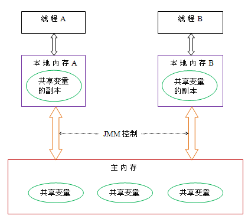

JMM Java内存模型的一些概念

----

# JMM(Java Memory Model)

## 并发编程的三个性质

JMM关键技术点是围绕着多线程的原子性、可见性、有序性来建立的。

### 原子性

原子性是指**一个操作是不可中断的，要么全部执行成功要么全部执行失败**。

比如 a++ 操作，实际包含三步：

1. 读取变量a的值，假如a=1
2. a的值+1，为2
3. 将2值赋值给变量a，此时a的值为2

这三步是不可分割的，所以必须保证这3步操作时原子性的，在操作a++的过程中，其他线程不会改变a的值，如果在该过程中出现其他线程修改了a的值，上面的操作应该执行失败。

java中实现原子操作的方法大致有2种：**锁机制、无锁CAS机制**

### 可见性

可见性是指**一个线程对共享变量的修改，对于其他线程来说是可以看到的**。

共享变量可见性的**实现原理**：

1. 线程A在自己的工作内存中修改变量之后，需要将变量的值刷新到主内存中 
2. 线程B要把主内存中变量的值更新到工作内存中 

关于线程可见性的控制，可以使用**volatile、synchronized、锁**来实现

### 有序性

有序性指的是**程序按照代码的先后顺序执行**。

为了性能优化，编译器和处理器会进行指令重排序，有时候会改变程序语句的先后顺序，比如程序： 

```java
int a = 1; //1 
int b = 20; //2 
int c = a + b; //3
```

编译器优化后可能变成：

```java
int b = 20; //1 
int a = 1; //2 
int c = a + b; //3
```

## Java内存模型

​		JMM决定一个线程对共享变量的写入何时对另一个线程可见。从抽象的角度来看，JMM定义了线程和主内存之间的抽象关系：**线程之间的共享变量存储在主内存（main memory）中，每个线程都有一个私有的本地内存（local memory），本地内存中存储了该线程以读/写共享变量的副本。**

​		**作用：** 在并行机制的前提下，定义了一种规则，保证多个线程间可以有效正确地协同工作。

​		本地内存是JMM的一个抽象概念，并不真实存在。它涵盖了缓存，写缓冲区，寄存器以及其他的硬件和编译器优化。其关系模型图如下图所示：

{.fancybox}

从上图中可以看出，线程A需要和线程B通信，必须要经历下面2个步骤： 

1. 首先，线程A把本地内存A中更新过的共享变量刷新到主内存中去 
2. 然后，线程B到主内存中去读取线程A之前已更新过的共享变量

**一个例子**

```java
public class Demo {
    public static boolean flag = true;
    public static class T1 extends Thread {
        public T1(String name) {
            super(name);
        }
        @Override
        public void run() {
            System.out.println("线程" + this.getName() + " in");
            while (flag) {;}
            System.out.println("线程" + this.getName() + "停止了");
        }
    }
    public static void main(String[] args) throws InterruptedException {
        new T1("t1").start();
        //休眠1秒
        Thread.sleep(1000);
        //将flag置为false
        flag = false;
    }
}
```

运行后会发现程序无法终止，也就是说主线程将flag修改为false后，线程t1获取的flag的值依旧为true。

**可能的原因：**

* 主线程修改了flag之后，未将其刷新到主内存，所以t1看不到 

* 主线程将flag刷新到了主内存，但是t1一直读取的是自己工作内存中flag的值，没有去主内存中获 取flag最新的值

**解决：**

​		使用volatile修饰共享变量，`public volatile static boolean flag = true;`

> 被volatile修改的 变量有以下特点：
>
> 1. 线程中读取的时候，每次读取都会去主内存中读取共享变量最新的值，然后将其复制到工作内存
> 2. 线程中修改了工作内存中变量的副本，修改之后会立即刷新到主内存

**运行结果：**

```java
线程t1 in
线程t1停止了
```

从该例子可知，**volatile解决了共享变量在多线程中可见性的问题**。


> 更多内容：[JMM理解整理](https://blog.csdn.net/zs88897/article/details/106385245/)