JVM是JRE的一部分，是一个虚构出来的计算机，是通过在实际的计算机上仿真模拟各种计算机功能来实现的。

---

# JVM探究

- 请你谈谈你对JVM的理解？java8虚拟机和之前的变化更新”	
- 什么是OOM？什么是栈溢出StackOverFlowError？怎么分析？
- JVM的常用调优参数有哪些？
- 内存快照如何抓取？怎么分析Dump文件?知道吗？谈谈JVM中，类加载器你的认识？

> [**jvm java运行时数据分析，垃圾回收**](https://processon.com/view/5c749debe4b0f9fba6921d15)
>
> [**JVM内存模型完整版**](https://processon.com/view/5ea7a1b9e401fd21c196eb17)

## 1. JVM的位置

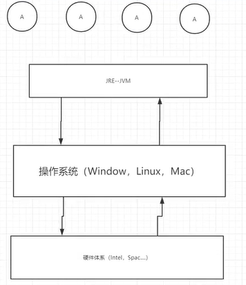{.fancybox}

## 2. JVM的体系结构

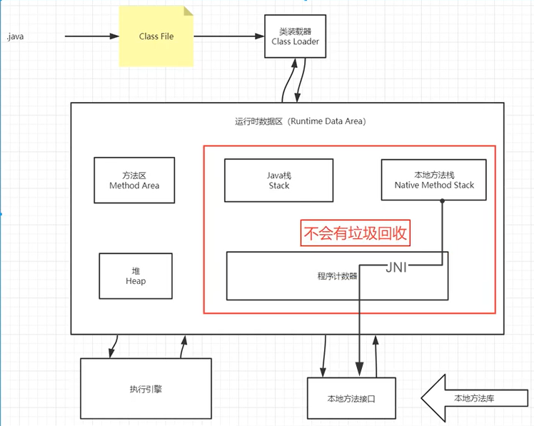{.fancybox}

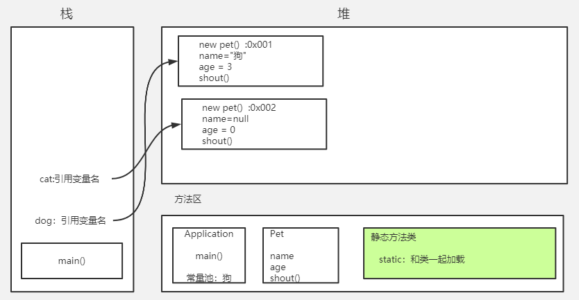{.fancybox}

## 3. 类加载器

作用：加载Class文件

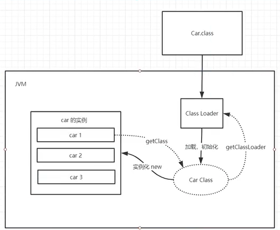{.fancybox}

虚拟机自带的加载器

1. **启动类（根）加载器 Bootstrap ClassLoader**

   加载`java`核心库 `java.*`，构造`ExtClassLoader`和`AppClassLoader`

2. **扩展类加载器 Extension ClassLoader**

   加载扩展库，如`classpath`中的`jre` ，`javax.*`或者`java.ext.dir` 指定位置中的类，开发者可以直接使用标准扩展类加载器。

3. **应用程序（系统类）加载器 AppClassLoader**

   加载程序所在的目录，如`user.dir`所在的位置的`class`

4. **用户自定义类加载器 CustomClassLoader**

   用户自定义的类加载器,可加载指定路径的`class`文件

```java
System.out.println(classLoader); //AppClassLoader
System.out.println(classLoader.getParent()); //ExtClassLoader jre\lib\ext
System.out.println(classLoader.getParent().getParent); //null jre\lib\rt.jar
```

## 4. 双亲委派机制

APP -- EXC -- BOOT

向上委托，向下查找

**过程**

1. 类加载器收到类加载的请求!
2. 将这个请求向上委托给父类加载器去完成，一直向上委托，直到启动类加载器 （loadClass(name, false), findBootstrapClassOrNull(name)）
3. 启动类加载器检查是否能够加载当前这个类，能加载就结束，使用当前的加载器，否则， 抛出异常，通知子加载器进行加载 （fingClass(name)）
4. 重复步骤3
   Class Not Found ~

{.fancybox}

**作用**

* 防止加载同一个`.class`。通过委托向上一级询问，加载过了，就不用再加载一遍，保证数据安全
* 保证核心`.class`不能被篡改。通过委托方式，不会去篡改核心`.clas`，即使篡改也不会去加载，即使加载也不会是同一个`.class`对象了。不同的加载器加载同一个`.class`也不是同一个`Class`对象。这样保证了`Class`执行安全。

## 5. 沙箱安全机制

​		沙箱是一个限制程序运行的环境。沙箱机制就是将 Java 代码限定在虚拟机(JVM)特定的运行范围中，并且严格限制代码对本地系统资源访问，通过这样的措施来保证对代码的有效隔离，防止对本地系统造成破坏。沙箱**主要限制系统资源访问**，那系统资源包括什么？——`CPU、内存、文件系统、网络`。不同级别的沙箱对这些资源访问的限制也可以不一样。

> [java中的安全模型(沙箱机制)](https://blog.csdn.net/qq_30336433/article/details/83268945)

## 6. Native

native关键字：说明java的作用范围达不到了，进入本地方法栈，调用本地方法接口（JNI）去调用底层的库。

**JNI：Java Native Interface（Java本地方法接口）**
凡是带了native关键宇的方法就会进入本地方法栈，其他的就是Java栈

**Native Interface**本地接口
		本地接口的作用是融合不同的编程语言为Java所用，它的具体做法是在Native Method Stack中登记native方法，在(Execution Engine )执行引擎执行的时候加载Native Libraies.

​		目前该方法使用的越来越少了，除非是与硬件有关的应用，比如通过Java程序驱动打印机或者Java系统管理生产设备，在企业级应用中已经比较少见。因为现在的异构领域间通信很发达，比如可以使用Socket通信，也可以使用Web Service等等，不多做介绍!

**Native Method Stack**

## 7. PC寄存器

程序计数器: Program Counter Register
		每个线程都有一个程序计数器，是线程私有的，就是一个指针， 指向方法区中的方法字节码(用来存储指向一条指令的地址，也即将要执行的指令代码)，在执行引擎读取下一-条指令,是一个非常小的内存空间，几乎可以忽略不计

## 8. 方法区（静态区）

Method Area方法区
		方法区是被所有线程共享,所有字段和方法字节码，以及-一些特殊方法，如构造函数,接口代码也在此定义，简单说，所有定义的方法的信息都保存在该区域，**此区域属于共享区间**；
		==静态变量、常量、类信息(构造方法、接口定义)、串池、运行时的常量池存在方法区中，但是实例变量存在堆内存中，和方法区无关==

​		static、final、Class、常量池（对象字面量：基本类型的包装类对象字面量[-128,127]，String对象字面量）

## 9. 栈内存

栈（栈内存），主管线程的运行，生命周期和线程同步

线程结束栈内存就释放了，栈内存空了程序就结束了；不存在垃圾回收问题

栈内存常存放：局部变量 基本数据类型、对象引用、方法引用

栈内存运行原理：栈帧

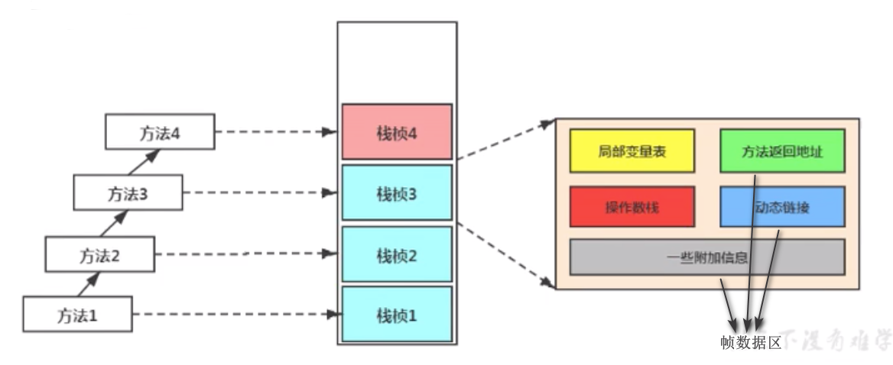{.fancybox}

> [Java虚拟机栈--栈帧](https://www.cnblogs.com/yanl55555/p/12616356.html)

## 10. 三种JVM

* Sun公司：`Java HotSpot(TM) 64-Bit Server VM (build 25.221-b11, mixed mode)`
* BEA公司：`Oracle JRockit （原来的 Bea JRockit）`
* IBM公司：J9VM

## 11. 堆内存

Heap，一个JVM只有一个堆内存，堆内存的大小是可以调节的。
类加载器读取了类文件后，一般会把什么东西放到堆中？==类, 方法，常量，变量，保存引用类型的真实对象==

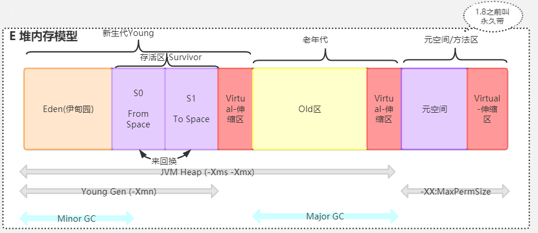{.fancybox}

* 新生区
  * Eden区
  * Survivor from区
  * Survivor to区
  * 8:1:1
* 老年区
* 元空间  永久区

轻GC在新生区，重GC(full GC)在老年区

假设内存满了，OOM，堆内存不够！ `java.lang.OutOfMemoryError: Java heap space`

## 12. 新生区 老年区

## 13. 永久区

这个区域常驻内存的。用来存放JDK自身携带的lass对象。Interface元数据， 存储的是ava运行时的一些环境或类信息，不存在垃圾回收。关闭jvm虚拟机会释放这个区域的内存。

* jdk1.6之前：永久代，常量池是在方法区；
* jdk1.7：永久代，但是慢慢的退化了，去永久代，常量池在堆中
* jdk1.8之后：无永久代，被元空间所取代，最大区别：==元空间并不在虚拟机中，而是使用本地内存。==

## 14. 堆内存调优

```java
// 返回jvm试图使用的最大内存
long max = Runtime.getRuntime().maxMemory();
// 返回jvm的初始化总内存，会随着时间发生变化
long total = Runtime.getRuntime().totalMemory();
```

默认情况下，maxMemory是电脑内存的1/4，totalMemory是1/64

`-Xms1024m -Xmx1024m -XX:+PrintGCDetails` 

>  -Xms<size> 设置初始Java堆大小
>
>  Xmx<size> 设置最大Java堆大小

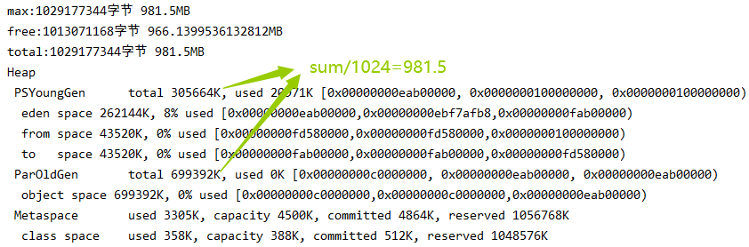


```java
// -Xms8m -Xmx8m -XX:+PrintGCDetails
String str = "str";
while(true) {
    str = str +new Random().nextInt(999999999)+str;
}
// 先进行了5次轻GC，Eden区进入Survivor区导致，满了（或者年龄即轻GC次数到了），进入老年代，老年代满了，进行第一次重GC，清理年轻代，清理老年代(丢弃或进入元空间)...最后Java堆 老年代和元空间都满了 抛出OOM异常
```

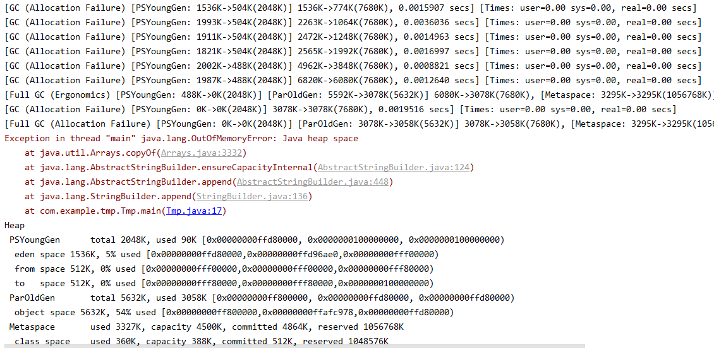

> GC表示的是进行一次Minor GC
> Allocation Failure：表示分配担保失败。
> PSYoungGen：新生代采用Parallel Scavenge收集器
> 1536K->504K(2048K)：GC前该区域已使用容量->GC后该区域已经使用的容量(该区域总容量)
> 1536K->817K(7680K)：方括号外的数字表示 GC前Java堆已用容量->GC后Java堆容量(Java堆总容量)
> 0.0013784 secs：该内存区域GC所用的时间
> Times: user=0.00 sys=0.00, real=0.00 secs：用户态消耗的CPU时间，内核态消耗的CPU时间，操作从开始到结束所经历的墙钟时间(Wall Clock Time)
>
> Full GC完全的垃圾回收
> Ergonomics工程
> ParOldGen老年代采用Parallel Old收集器
> Metaspace元数据空间垃圾回收

### Java内存分析工具

OOM，排错：

1. 尝试扩大堆内存看结果

   2. 分析内存，看一下那里出现问题（工具分析）
      * Debug，一行行分析代码
      * 内存快照分析工具，MAT，JProfiler

**MAT、Jprofiler作用：**

* 分析Dump内存文件，快速定位内存泄露
* 获取堆中的数据
* 获得大的对象
* ...

当抛出OOM时进行HeapDump：`-Xms1m -Xmx8m -XX:+HeapDumpOnOutOfMemoryError`

> [Jprofiler的安装和使用](https://blog.csdn.net/vicky_pyh/article/details/88797514)

## 15. GC

**目的：** 回收堆内存中不再使用的对象，释放资源
**回收时间：** 当对象永久地失去引用后，系统会在合适的时候回收它所占用的内存。

`System.gc(); / Runtime.getRuntime().gc();`

### 15.1 垃圾回收与常用算法

#### 如何确定垃圾？

* **引用计数法**

  ​		一个对象如果没有任何与之关联的引用，即他的引用计数都为0，则说明对象不太可能再被用到，那么这个对象就是可回收对象。会出现**循环引用问题**

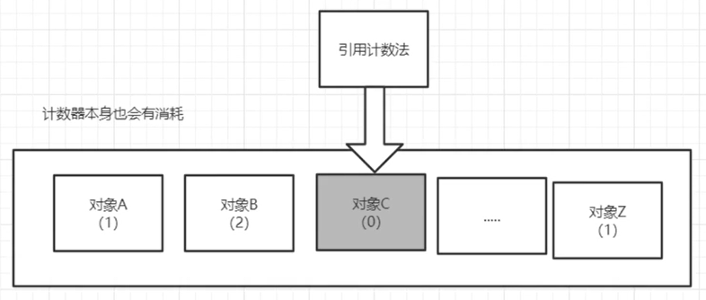{.fancybox}

* **可达性分析**

  ​		当一个对象到任意一个GC Roots对象没有任何引用链相连时，则称该对象是不可达的。 要注意的是，不可达对象不等价于可回收对象，不可达对象变为可回收对象至少要经过两次标记 过程。两次标记后仍然是可回收对象，则将面临回收。

#### 如何清除垃圾？

* **复制算法**

  将内存按内存容量划分为等大小的两块，当这块内存需要垃圾回收时,将此区域还存活的对象复制到另一块中，然后把这块内存清理掉。

  每次对整个半区进行操作，解决了内存碎片化的问题，但会多使用一定的内存空间，且存活对象较多时，效率会大大降低。

  **最佳应用场景：** 对象存活度较低的时候，新生代

  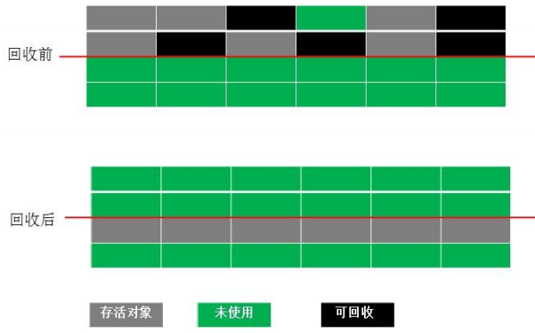{.fancybox}

* **标记清除法**

  最基础的垃圾回收算法，分为两个阶段，==标记和清除==。标记阶段标记出所有需要回收的对象，清除阶段回收所有被标记的对象。

  内存碎片化严重，可能发生大对象找不到可利用空间的问题。

  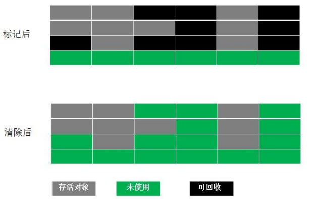{.fancybox}

* **标记整理法**

  标记后将存活对象移向内存的一端，然后清除端边界外的对象。

  防止了内存碎片的产生，整理需耗用一定时间

  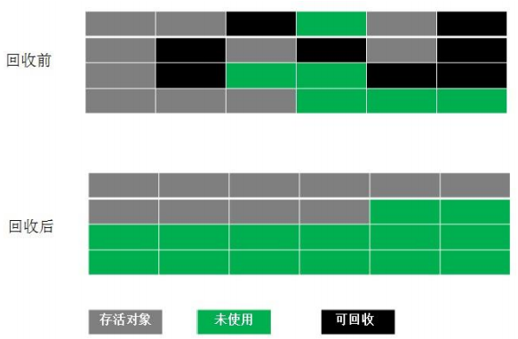{.fancybox}

* **标记清除整理**：先标记清除，内存碎片较多时再使用标记整理

* **分代收集法 GC**

  根据对象存活的不同生命周期将内存划分为不同的域，一般情况下将 GC 堆划分为==新生代(Young Generation)==和==老生代(Tenured/Old Generation)==。

  **新生代**的特点是对象生存时间比较短，存活率低，每次可回收的垃圾对象较多，采用复制算法。

  ​	**HotSpot实现的复制算法流程：**

  1. 当Eden区满的时候会触发第一次Minor gc，把还存活的对象拷贝到Survivor From区中。
  2. 当Eden区再一次触发Minor gc时，会对Eden区和Survivor From区进行垃圾回收,把还存活的对象复制到To区域,并将Eden和From区清空，此时Form和To名称交换。
  3. 有些对象会在From区和To区来回复制，如此交换15次(默认为15次,`-XX:MaxTenuringThreshold=15`)，最终如果还是存活，就存入老年代。

  **老生代**的特点是空间比较大，存活率高，每次可回收的垃圾对象较少，采用标记清除(内存碎片较少)和标记整理算法。

* **总结**

  内存效率：复制算法 > 标记清除算法 > 标记整理算法(时间复杂度)
  内存整齐度：复制算法 = 标记整理算法 > 标记清除算法
  内存利用率：标记整理算法 = 标记清除算法 > 复制算法

## 16. JMM(Java Memory Model)

​		JMM决定一个线程对共享变量的写入何时对另一个线程可见。从抽象的角度来看，JMM定义了线程和主内存之间的抽象关系：==线程之间的共享变量存储在主内存（main memory）中，每个线程都有一个私有的本地内存（local memory），本地内存中存储了该线程以读/写共享变量的副本。==

​		本地内存是JMM的一个抽象概念，并不真实存在。它涵盖了缓存，写缓冲区，寄存器以及其他的硬件和编译器优化。其关系模型图如下图所示：JMM对这八种指令的使用，制定了如下规则：

{.fancybox}


> 更多内容：[深入理解java虚拟机（全章节完整）](https://blog.csdn.net/TJtulong/article/details/89598598)