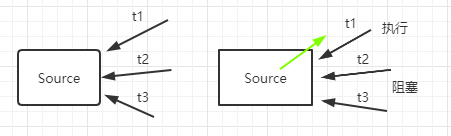
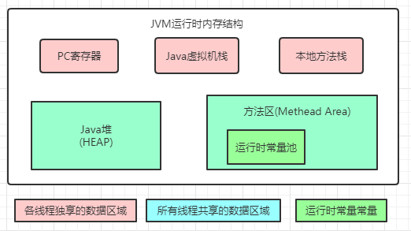
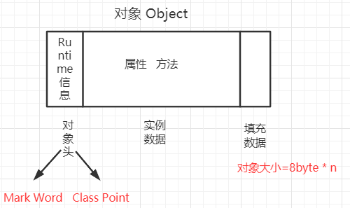
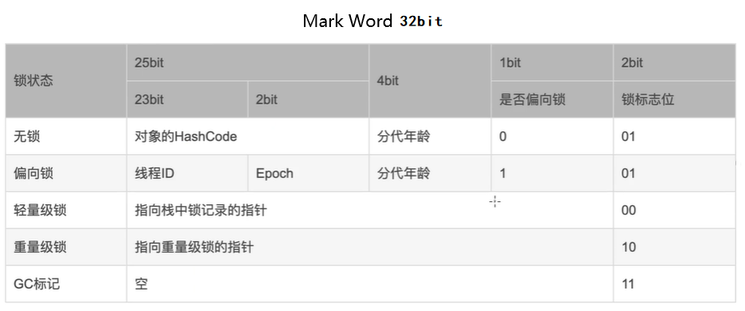
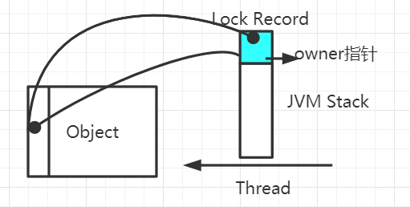

对程序员来说并发编程是一个编程难点，Java的锁机制也尤为重要。

---

## 什么是锁？

​		在并发环境下，多个线程会对同一个资源进行争夺，这就可能导致数据不一致的问题，由此，很多编程语言引入了锁机制，用于**保证业务执行过程中数据被锁住不会被外界修改**。



## Java锁机制

Java虚拟机运行时内存结构



### Object对象

​		每个Object，也就是每个对象都拥有一把锁，其存放在对象头中，锁中记录了当前对象被那个线程锁占用，对象大致结构如下：



* Class Point：指向当前对象类型所在方法区的类型数据
* Mark Word: 存储和当前对象运行状态相关的数据，主要用来**表示对象的线程锁状态**，也可用于配合GC、存放对象的hashcode



### 四种锁状态

**无锁 --> 偏向锁 --> 轻量级锁 --> 重量级锁，==只能升级不能降级==**

### 重量级锁

**synchronized**

​	==同步线程==，其被编译后，会生成`monitorenter`和`monitorexit`

​	性能问题：mutex lock，Java线程实际是对操作系统线程的映射，因此每次挂起或唤醒一个线程时都要切换操作系统内核态，过于重量级

在Java 6 中对synchronized进行了优化，引入了轻量级锁和偏向锁

### 轻量级锁

​		当线程检查到对象的锁为轻量级锁时，其会在自己的虚拟机栈中开辟一块**Lock Record**的空间，用于**存放MarkWord的副本和owner指针**。

​		**线程和对象锁绑定：** 当线程通过CAS操作获取到对象的锁后，会把对象头中的Markword复制到开辟的LockRecord空间中，并把owner指针指向该对象，而对象头中的前30bit也将生成一个指针指向该LockRecord，这便完成了绑定。



#### 自旋锁

​		如果持有锁的线程能在很短时间内释放锁资源，那么那些等待竞争锁的线程就不需要做内核态和用户态之间的切换进入阻塞挂起状态，它们只需要**自旋等待**， 等持有锁的线程释放锁后即可立即获取锁，这样就==避免用户线程和内核的切换的消耗==。当自旋线程过多或自旋次数(`-XX:PreBlockSpin`)过多，则会升级为重量级锁。

#### 适应性自旋锁

​		如果某个线程最近获取过锁，那么它的自旋次数则可以更多，反之，若其很少能够自旋成功，则其自旋次数会大大减少甚至去除自旋过程，以避免资源浪费。

### 偏向锁

​		大多数情况下锁不仅不存在多线程竞争，而且总是由同一线程多次获得。因此，在线程无竞争时，偏向锁会偏向于第一个访问它的线程，==消除该线程重入(CAS置换ThreadID)的开销==，当后一个线程进入如果获取不到锁，则会在前一个线程的安全点暂停，然后后个线程将锁升级为轻量级锁。

​		作用：提高单线程访问同步资源的性能，如果一直是多线程访问的，那么升级偏向锁也是额外开销，可通过`-XX:-UseBiasedLocking`关闭偏向锁。

> [Java偏向锁](https://blog.csdn.net/weixin_42213903/article/details/97044043)

### 无锁

所有线程都可访问共享资源

场景：

* 不在多线程环境，或多线程无竞争

* 存在竞争，用无锁方式同步线程

  * CAS (Compare and Swap)

    CAS在操作系统通过一条指令实现，是保证原子性的。

    CAS算法大致过程：三个参数，CAS(V, E, N)，V：要更新的变量(内存地址)，E：旧的预期值，N：新值。当且仅当V值等于E值时，才会将V的值设为N，如果不同，则什么也不做

    缺点：循环时间CPU开销大，只能保证单个变量的原子性，ABA问题

```java
public class CASTest implements Runnable {
    private static AtomicBoolean value = new AtomicBoolean(true);
    private int i = 0;
    public static void main(String[] args) {
        CASTest casTest = new CASTest();
        Thread t1 = new Thread(casTest);
        Thread t2 = new Thread(casTest);
        t1.start();
        t2.start();
    }
    @Override
    public void run() {
        if (value.compareAndSet(true, false)) {
            System.out.print(Thread.currentThread().getName()+", "+value.get());
            i++;
            System.out.println("; i: " + i);
            try {
                Thread.sleep(5000);
            } catch (InterruptedException e) {
                e.printStackTrace();
            }
            value.set(true);
        }else {
            System.out.println("500ms后重试:"+Thread.currentThread().getName());
            try {
                Thread.sleep(500);
            } catch (InterruptedException e) {
                e.printStackTrace();
            }
            run();
        }
    }
}
--------------------------
Thread-0, false; i: 1
500ms后重试:Thread-1
500ms后重试:Thread-1
500ms后重试:Thread-1
500ms后重试:Thread-1
500ms后重试:Thread-1
500ms后重试:Thread-1
500ms后重试:Thread-1
500ms后重试:Thread-1
500ms后重试:Thread-1
500ms后重试:Thread-1
Thread-1, false; i: 2
```

<script>
    let imgs = document.getElementsByTagName('img');
    for (let img of imgs) {
        img.setAttribute('class', 'fancybox');
    }
</script>