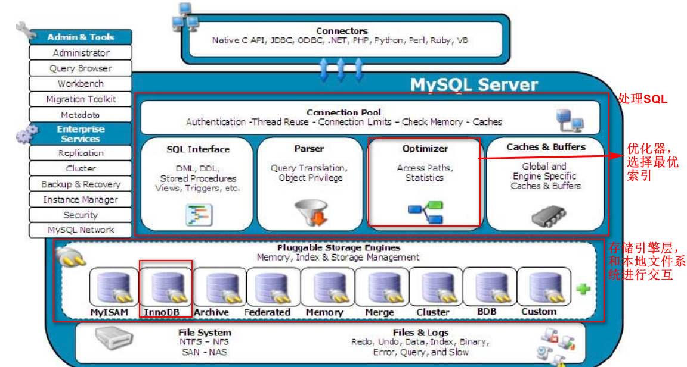

MySQL架构介绍、存储引擎介绍、日志文件、数据文件介绍

---

# MySQL架构篇

## 存储引擎介绍

与其他数据库例如Oracle和SQL Server等数据库中只有一种存储引擎不同的是, MySQL有一个被称为"Pluggable Storage Engine Architecture" (可插拔的存储引擎架构)的特性，也就意味着MySQL数据库提供了多种存储引擎。

而且**存储引擎是针对表**的，用户可以根据不同的需求为数据表选择不同的存储引擎，用户也可以根据自己的需要编写自己的存储引擎。也就是说，同一数据库不同的表可以选择不同的存储引擎。

`creat table xxx() engine=InnoDB/Memory/MyISAM`

简而言之，存储引擎就是如何存储数据、如何为存储的数据建立索引和如何更新、查询数据等技术的实现方法。

* **MySQL存储引擎种类**

| 存储引擎              | 说明                                                         |
| --------------------- | ------------------------------------------------------------ |
| **MyISAM**            | 高速引擎,拥有较高的插入,查询速度,但**不支持事务**            |
| **InnoDB**            | 5.5版本后MySQL的默认数据库，支持事务和行级锁定，比MyISAM处理速度稍慢 |
| ISAM                  | MyISAM的前身, MySQL5 . 0以后不再默认安装                     |
| MRG_ MyISAM ( MERGE ) | 将多个表联合成一个表使用，在超大规模数据存储时很有用         |
| **Memory**            | **内存存储引擎，拥有极高的插入，更新和查询效率**。但是会占用和数据量成正比的内存空间。只在内存.上保存数据,意味着数据可能会丢失 |
| Falcon                | 一种新的存储引擎,支持事物处理,传言可能是InnoDB的替代者       |
| Archive               | 将数据压缩后进行存储,非常适合存储大量的独立的，作为历史记录的数据,但是只能进行插入和查询操作 |
| CSV                   | CSV存储引擎是基于CSV 格式文件存储数据(应用于跨平台的数据交换) |

* 查看存储引擎：

  `mysql> show engines`

* **InnoDB和MyISAM存储引擎区别**

|              | Myisam                                          | Innodb                                                  |
| ------------ | ----------------------------------------------- | ------------------------------------------------------- |
| **存储文件** | .frm表定义文件 **. ibd数据文件和索引文件** | .frm表定义文件 **.myd数据文件 .myi索引文件.** |
| **锁**       | 表锁、**行锁**                                  | 表锁                                                    |
| **事务**     | 支持                                            | 不支持                                                  |
| **CRDU**     | 读、写                                          | 读多                                                    |
| **count**    | 扫表                                            | 专门存储的地方                                          |
| **索引结构** | B+ Tree                                         | B+ Tree                                                 |

> 表级锁：开销小，加锁快；不会出现死锁；锁定粒度大，发生锁冲突的概率最高,并发度最低。
>
> 行级锁：开销大，加锁慢；会出现死锁；锁定粒度最小，发生锁冲突的概率最低,并发度也最高。
>
> 页面锁：开销和加锁时间界于表锁和行锁之间；会出现死锁；锁定粒度界于表锁和行锁之间，并发度一般

## 物理文件

### 日志文件（顺序IO）

MySQL通过日志记录了数据库操作信息和错误信息。常用的日志文件包括错误日志、二进制日志、查询日志、慢查询日志和事务Redo日志、中继日志等。

#### 错误日志（errorlog）

默认是开启的,而且从5.5.7以后无法关闭错误日志,错误日志记录了运行过程中遇到的所有严重的错误信息,以及MySQL每次启动和关闭的详细信息。

#### 二进制日志(bin log )

默认是关闭的
binlog记录了数据库所有的dd1语句和dm1语句,但不包括select语句内容,语句以事件的形式保存,描述了数据的变更顺序, binlog还包括了每个更新语句的执行时间信息。如果是DDL语句,则直接记录到binlog日志,而DML语句,必须通过事务提交才能记录到binlog日志中。
binlog主要用于实现mysq1主从复制、数据备份、数据恢复。

#### 通用查询日志( general query log )

默认情况下通用查询日志是关闭的。

#### 慢查询日志( slow query log )

默认是关闭的。

#### 重做日志( redo 1og )

作用:

* 确保事务的持久性。
* 防止在发生故障的时间点,尚有脏页未写入磁盘，在重启mysq1服务的时候，根据redo 1og进行重做，从而达到事务的持久性这一特性。

#### 回滚日志( undo log)

作用:

* 保存了事务发生之前的数据的一个版本，可以用于回滚，同时可以提供多版本并发控制下的读( MVCC ) , 也即非锁定读

#### 中继日志( relay log )

* 是在主从复制环境中产生的日志。
* 主要作用是为了从机可以从中继日志中获取到主机同步过来的SQL语句，然后执行到从机中。

### 数据文件(随机IO)

#### InnoDB数据文件

* .frm文件:主要存放与表相关的数据信息,主要包括表结构的定义信息
* . ibd :使用独享表空间存储表数据和索引信息, 一张表对应一个ibd文件
* ibdata文件 :使用共享表空间存储表数据和索引信息,所有表共同使用一个或者多个ibdata文件。

#### MyIsam数据文件

* .frm文件:主要存放与表相关的数据信息,主要包括表结构的定义信息
* . myd文件:主要用来存储表数据信息。
* .myi文件:主要用来存储表数据文件中任何索引的数据树。

---

> [MySQL性能优化01：主题和目标](http://lampkins.gitee.io/2020/10/26/MySQL性能优化01/)
>
> [MySQL性能优化02：MySQL架构篇](http://lampkins.gitee.io/2020/10/26/MySQL性能优化02/)
>
> [MySQL性能优化03：MySQL性能分析篇](http://lampkins.gitee.io/2020/10/26/MySQL性能优化03/)
>
> [MySQL性能优化04：MySQL索引篇01索引讲解](http://lampkins.gitee.io/2020/10/26/MySQL性能优化04/)
>
> [MySQL性能优化05：MySQL索引篇02查看执行计划](http://lampkins.gitee.io/2020/10/26/MySQL性能优化05/)
>
> [MySQL性能优化06：MySQL索引篇03索引失效分析](http://lampkins.gitee.io/2020/10/26/MySQL性能优化06/)
>
> [MySQL性能优化07：性能优化篇](http://lampkins.gitee.io/2020/10/26/MySQL性能优化07/)

