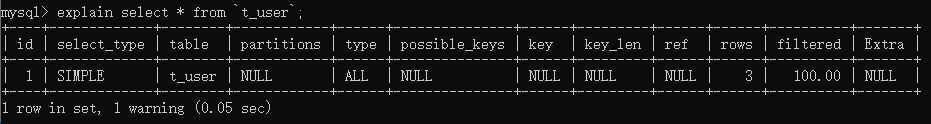

MySQL性能分析之慢查询日志介绍和show profile介绍

---

# MySQL性能分析篇

## 性能分析的思路

1. 首先需要使用【慢查询日志】功能，去获取所有查询时间比较长的SQL语句。上线前开，生产中一般不使用。
2. 其次【查看执行计划】查看有问题的SQL的执行计划
3. 最后可以使用【show profile[s]]】查看有问题的SQL 的性能使用情况

## 慢查询日志

​		数据库查询快慢是影响项目性能的一大因素,对于数据库，我们除了要优化SQL，更重要的是得先==找到需要优化的SQL==。 MySQL数据库有一个**“慢查询日志“**功能，用来记录查询时间超过某个设定值的SQL语句，这将极大程度帮助我们==快速定位到症结所在==，以便对症下药。
至于查询时间的多少才算慢,每个项目、业务都有不同的要求。

**作用：**记录在MySQL中响应时间超过阀值的语句，即运行时间超过long_query_time值的SQL，会被记录到慢查询日志中。

MySQL的慢查询日志功能==默认是关闭的,需要手动开启==。

> [MySQL慢查询日志总结](https://www.cnblogs.com/saneri/p/6656161.html)

## explain执行计划

​		EXPLAIN 命令是查看查询优化器如何决定执行查询的主要方法，使用EXPLAIN，只需要在查询中的SELECT关键字之前增加EXPLAIN这个词即可，MYSQL会在查询上设置一个标记，当执行查询时，这个标记会使其返回关于在执行计划中每一步的信息，它会返回一行或多行信息，显示出执行计划中的每一部分和执行的次序，从而可以从分析结果中找到查询语句或表结构的性能瓶颈。

**EXPLAIN作用**

* 分析出表的读取顺序
* 数据读取操作的操作类型
* 哪些索引可以使用
* 哪些索引被实际使用
* 表之间的引用
* 每张表有多少行被优化器查询 

```sql
-- 使用时在前面加上explain即可
explain select * from tbl_dept;
```



> [MySQL — 优化之explain执行计划详解（转）](https://www.cnblogs.com/myseries/p/10736268.html)

## profile分析语句

Query Profiler是MySQL 自带的一种query诊断分析工具通过它可以分析出一 条SQL语句的硬件性能瓶颈在什么地方。

通常我们使用的explain，以及slow query log都无法做到精确分析，但是Query Profiler却可以定位出一条SQL语句执行的各种资源消耗情况，比如CPU/IO等，以及该SQL执行所耗费的时间等。不过该工具只有在MySQL5.0.37以及以上版本中才有实现。

MYSQL的该功能==默认是关闭的，需要手动启动==。

---

> [MySQL性能优化01：主题和目标](http://lampkins.gitee.io/2020/10/26/MySQL性能优化01/)
>
> [MySQL性能优化02：MySQL架构篇](http://lampkins.gitee.io/2020/10/26/MySQL性能优化02/)
>
> [MySQL性能优化03：MySQL性能分析篇](http://lampkins.gitee.io/2020/10/26/MySQL性能优化03/)
>
> [MySQL性能优化04：MySQL索引篇01索引讲解](http://lampkins.gitee.io/2020/10/26/MySQL性能优化04/)
>
> [MySQL性能优化05：MySQL索引篇02查看执行计划](http://lampkins.gitee.io/2020/10/26/MySQL性能优化05/)
>
> [MySQL性能优化06：MySQL索引篇03索引失效分析](http://lampkins.gitee.io/2020/10/26/MySQL性能优化06/)
>
> [MySQL性能优化07：性能优化篇](http://lampkins.gitee.io/2020/10/26/MySQL性能优化07/)

<script>
    let imgs = document.getElementsByTagName('img');
    for (let img of imgs) {
        img.setAttribute('class', 'fancybox');
    }
</script>