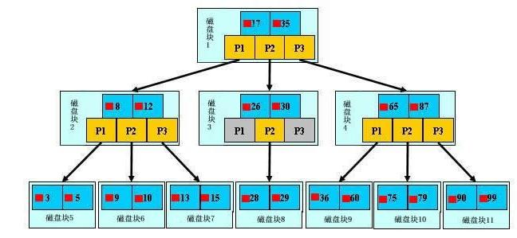
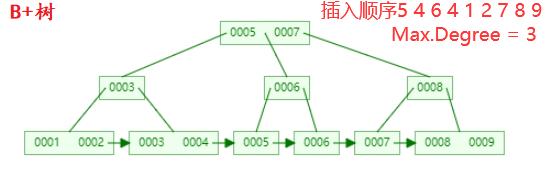
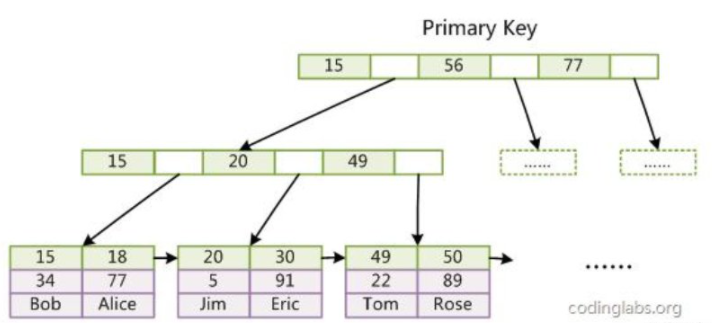
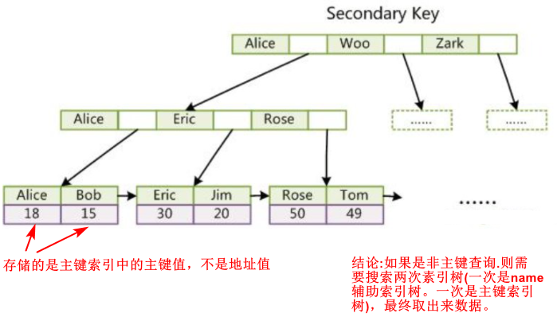
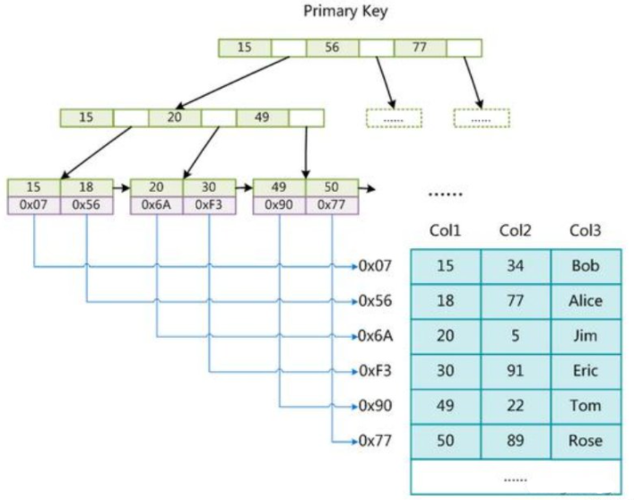
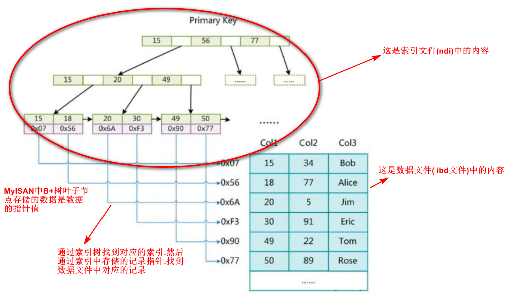
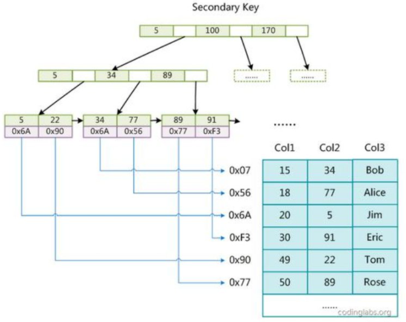

MySQL 索引讲解

---

# MySQL索引篇

## 索引介绍

### 索引是什么

* MySQL官方对索引的定义为：索引(Index)是帮助MySQL**高效获取数据的数据结构**，通俗来讲索引就好比书本的目录，**加快数据库的查询速度。**
* **使用B+树结构组织(多路搜索树，并不一定是二叉的)的索引。**
* **索引是存储在磁盘文件中的**(可能在单独的索引文件中，也可能和数据一 起存储在数据文件中)。

### 索引的优势和劣势

**优势：**

* 可以**提高数据检索的效率，降低数据库的IO成本**，类似于书的目录。

* 通过**索引列对数据进行排序**，降低数据排序的成本，降低了CPU的消耗。
  * 被索引的列会自动进行排序，包括【单列索引】和【组合索引】， 只是组合索引的排序要复杂一些
  * 如果按照索引列的顺序进行排序，对应order by语句来说，效率就会提高很多。

**劣势**：

* **索引会占据磁盘空间**
* **索引虽然会提高查询效率，但是会降低更新表的效率**。每次对表进行增删改操作，MySQL不仅要保存数据，还要保存或者更新对应的索引文件。

## 常用索引分类

### 单列索引

* 普通索引：MySQL中基本索引类型，没有什么限制，允许在定义索引的列中插入重复值和空值，纯粹为了查询数据更快一点。
* 唯一索引：索引列中的值必须是唯一的，但是允许为空值。
* 主键索引：是一种特殊的唯一索引，不允许有空值。

### 组合索引

* 在表中的**多个字段组合上创建的一个索引**
* 组合索引的使用，需要遵循**最左前缀原则(最左匹配原则)**。
* 一般情况下，**建议使用组合索引代替单列索引**(主键索引除外，具体原因后面知识点讲解)。

### 全文索引

* 只有在**MyISAM引**擎上才能使用
* 只能在**CHAR,VARCHAR,TEXT**类型字段上使用全文索引
* 占用很大的物理空间和降低了记录修改性，较为少用。

## 索引的简单使用

### 创建索引

* 单列索引之普通索引

```mysql
CREATE INDEX index_name ON table_name(column(length));
ALTER TABLE table_name ADD INDEX index_name (column(length));
```

* 单列索引之唯一索引

```mysql
CREATE UNIQUE INDEX idnex_name ON table (column(length));
```

* 单列索引之全文索引

```mysql
CREATE FULLTEXT INDEX index_name ON table(column(length));
```

* 组合索引

```mysql
ALTER TABLE article ADD INDEX index_titme_time (title(50)，time(10))
```

==注意：创建索引时，可以指定索引列的长度，但是数字类型不要指定==

### 删除索引

```mysql
DROP INDEX index_name ON table_name
```

### 查看索引

```mysql
SHOW INDEX FROM table_name
```

## 索引的存储结构

### 索引存储结构介绍

* 索引是**在存储引擎中实现**的，也就是说不同的存储引擎，会使用不同的索引数据结构。
* **MyISAM和InnoDB存储引擎**：只支持**BTREE索引**，也就是说**默认使用BTREE，不能够更换。**
* MEMORY/HEAP存储引擎：支持HASH和BTREE索引。

### B树和B+树

[数据结构示例网站](https://www.cs.usfca.edu/~galles/visualization/Algorithms.html)

#### B树图示

B树是为了磁盘或其它存储设备而设计的一种多叉平衡查找树(下面你会看到，相对于二叉， B树每个内结点有多个分支，即多叉)。



* B树的高度一般都是在2-4这个高度，树的高度直接决定I0读写的次数以及查询时间复杂度( log(n) )。
* B树三层可以存储bigint类型的主键10亿条
* 如果是三层树结构---支撑的数据可以达到20G ，如果是四层树结构---支撑的数据可以达到几十T



#### B树和B+树的区别

B树和B+树的最大区别在于==非叶子节点是否存储数据==的问题。

* B树是非叶子节点和叶子节点都会存储数据。
* B+树只有叶子节点才会存储数据，而且存储的数据都是在一行上，而且这些数据都是有指针指向的，是有顺链表。

### 聚集索引（InnoDB）

Cluster Index：聚簇索引(索引组织表)。

InnoDB存储引擎的数据组织方式，是聚簇索引表：**完整的记录，存储在主键索引中，通过主键索引，就可以获取记录所有的列，也就是说表数据和索引是在一起，这就是聚集索引。**

> 更多：[Clustered and Secondary Indexes](https://dev.mysql.com/doc/refman/8.0/en/innodb-index-types.html)

#### 主键索引

主键索引（聚集索引）的叶子节点会存储数据行，辅助索引只会存储主键值。

InnoDB要求表必须有主键(MyISAM可以没有)，如果没有显式指定，则MySQL系统会自动选择一个可以唯一标识数据记录的列作为主键，如果不存在这种列，则MySQL自动为InnoDB 表生成-个隐含字段作为主键 ，类型为长整形。



上图是InnoDB 主索引(同时也是数据文件)的示意图，可以看到叶节点包含了完整的数据记录。这种索引叫做聚集索引。

> 如果没有主键？

​	选择唯一非空列，无选择则默认创建一个隐藏列作为主键

#### 辅助索引（次要索引）

InnoDB的所有辅助索引都引用主键作为data域。

聚集索引这种实现方式使得按主键的搜索十分高效，但是辅助索引搜索需要检索两遍索引：首先检索辅助索引获得主键，然后用主键到主索引中检索获得记录。



> 引申：为什么不建议使用过长的字段作为主键?

​	因为所有辅助索引都引用主索引，过长的主索引会令辅助索引变得过大。同时，请尽量在InnoDB 上采用自增字段做表的主键。

### 非聚集索引（MyISAM）

* B+树叶子节点只会存储数据行(数据文件)的指针,简单来说数据和索引不在一起，就是非聚集索引。
* 非聚集索引中的主键索引和辅助索引都会存储指针的值

#### 主键索引



这里设表一共有三列,假设我们以Col1为主键,则上图是一个MyISAM表的主索引(Primary key)示意。可以看出MyISAM的索引文件仅仅保存数据记录的地址。



#### 辅助索引（次要索引）

在 MyISAM 中，主索引和辅助索引(Secondary key)在结构上没有任何区别，只是主索引要求 key 是唯一的，而辅助索引的 key 可以重复。如果我们在 Col2 上建立一个辅助索引,则此索引的结构如下图所示



同样也是一颗 B+Tree，data 域保存数据记录的地址。因此，MyISAM 中索引检索的算法为首先按照 B+Tree 搜索算法搜索索引，如果指定的 Key 存在,则取出其data 域的值，然后以data 域的值为地址，读取相应数据记录。

## 组合索引使用

### 为什么使用组合索引

==为了节省mysq1索引存储空间以及提升搜索性能==，可建立组合索引（能使用组合索引就不使用单列索引）

例如：创建如下的一个组合索引，相当于建立了col1,col1 col2,col1 col2 col3三个索引：

```mysql
-- 以下语句会创建一颗B+tree ,但是它相对于三颗索引树的功效。
ALTER TABLE 'table_name' ADD INDEX index_ name('co11','co12','co13')
```

### 如何选择哪些列来创建组合索引?

1. 常出现在`where`条件中的列，建议用来创建组合索引，至于组合索引中的顺序，是很重要的，因为组合索引会使用到最左前缀原则。但是因为MySQL 中存在查询优化器，所以你的书写SQL条件的顺序，不一定是执行时候的`where`条件顺序。
2. 常出现在`order by`和`group by`语句中的列。最后按照顺序去创建组合索引。
3. 常出现在`select`语句中的列，也建议按照顺序，创建组合索引。

### 最左前缀原则

顾名思义，就是最左优先，这个最左是针对于组合索引和前缀索引，理解如下:

1. 最左前缀匹配原则，非常重要的原则，MySQL会一直向右匹配直到遇到范围查询(>、<、between、 like )就停止匹配 ==（索引最多用于一个范围列）== ，比如`a = 1 and b = 2 and c > 3 and d = 4`如果建立`(a, b, c, d)`顺序的索引，d是用不到索引的；如果建立`(a, b, d, c)`的索引则都可以用到，且a, b, d的顺序可以任意调整。
2. 如果通配符 % 不出现在开头，则可以用到索引，但根据具体情况不同可能只会用其中一个前缀
   like “value%” 可以使用索引，但是 like “%value%” 不会使用索引，走的是全表扫描.
3. =和in可以乱序，比如`a = 1 and b = 2 and C = 3`建立`(a, b, c)`索引，可以任意顺序, MySQL的查询优化器会帮你优化成索引可以识别的形式

## 如何使用索引

### 哪些情况需要创建索引

1. 主键自动建立唯一索引
2. 频繁作为查询条件的字段应该创建索引(业务)
3. 多表关联查询中,关联字段应该创建索引
4. 查询中统计或者分组字段,应该创建索引
5. 查询中排序的字段,应该创建索引

mysq1创建组合索引的规则是首先会对组合索引的最左边的，也就是第一个name字段的数据进行排序，在第一个字段的排序基础上，然后再对后面第二个的cid字段进行排序。其实就相当于实现了类似`order by name cid`这样一种排序规则。

### 哪些情况不需要创建索引

1. 表记录太少（少于1千）
2. 经常进行增删改操作的表
3. 频繁更新的字段
4. where条件里使用频率不高的字段

---

> [MySQL性能优化01：主题和目标](http://lampkins.gitee.io/2020/10/26/MySQL性能优化01/)
>
> [MySQL性能优化02：MySQL架构篇](http://lampkins.gitee.io/2020/10/26/MySQL性能优化02/)
>
> [MySQL性能优化03：MySQL性能分析篇](http://lampkins.gitee.io/2020/10/26/MySQL性能优化03/)
>
> [MySQL性能优化04：MySQL索引篇01索引讲解](http://lampkins.gitee.io/2020/10/26/MySQL性能优化04/)
>
> [MySQL性能优化05：MySQL索引篇02查看执行计划](http://lampkins.gitee.io/2020/10/26/MySQL性能优化05/)
>
> [MySQL性能优化06：MySQL索引篇03索引失效分析](http://lampkins.gitee.io/2020/10/26/MySQL性能优化06/)
>
> [MySQL性能优化07：性能优化篇](http://lampkins.gitee.io/2020/10/26/MySQL性能优化07/)

<script>
    let imgs = document.getElementsByTagName('img');
    for (let img of imgs) {
        img.setAttribute('class', 'fancybox');
    }
</script>