MySQL Explain查看执行计划

---

# MySQL索引篇

## 查看执行计划

### 建表语句

```mysql
create table `t_user`(
	id int primary key,
    name varchar(100),
    age int,
    sex char(1),
    address varchar(100)
);
create table `t_user_role` (
    uid int,
    rid int
);
alter table `t_user` add index idx_name_age(name(10), age);
alter table `t_user` add index idx_sex(sex);

insert into `t_user`(id,name,age,sex,address) values(1, 'zhangsan', 20, '0', '成都');
insert into `t_user`(id,name,age,sex,address) values(2, 'lisi', 30, '0', '成都');
insert into `t_user`(id,name,age,sex,address) values(3, 'lihong', 25, '1', '成都');

insert into `t_user_role`(uid, rid) values(1, 1);
```

特别说明：

==name列的长度是varchar(100)，但是创建索引的时候，指定的长度却是10，这是使用了[**前缀索引**](https://blog.csdn.net/ma2595162349/article/details/79449493)这个概念。==

### 介绍

使用explain这个命令来查看一个这些SQL语句的执行计划，查看该SQL语句有没有使用上了索引，有没有做全表扫描，这都可以通过explain命令来查看。

EXPLAIN命令用法十分简单，在SELECT语句前加上explain就可以了，例如:

### 参数说明

EXPLAIN命令的输出内容大致如下：

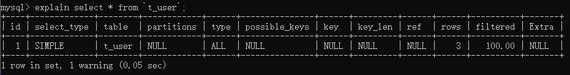

各列的含义如下：

| Column          |   JSON Name   |                           Meaning                           |
| --------------- | :-----------: | :---------------------------------------------------------: |
| id              |   select_id   | SELECT 查询的标识符，每个SELECT都会自动分配一个唯一的标识符 |
| **select_type** |     None      |                      SELECT 查询的类型                      |
| table           |  table_name   |                       查询的是哪个表                        |
| partitions      |  partitions   |                         匹配的分区                          |
| **type**        |  access_type  |                          join类型                           |
| possible_keys   | possible_keys |                  此次查询中可能选用的索引                   |
| key             |      key      |                 此次查询中确切使用到的索引                  |
| key_len         |  key_length   |                   用于处理查询的索引长度                    |
| ref             |      ref      |                哪个字段或常数与key一起被使用                |
| rows            |     rows      |        显示此查询一共扫描了多少行，这个是一个估计值         |
| filtered        |   filtered    |             表示此查询条件所过滤的数据的百分比              |
| **extra**       |     None      |                         额外的信息                          |

#### 1. id

每个单位查询的SELECT语句都会自动分配的一个唯一标识符，表示查询中操作表的顺序，有四种情况：
* id相同：执行顺序由上到下
* id不同：如果是子查询, id号会自增, id越大,优先级越高。
* id相同的不同的同时存在
* id列为null的就表示这是一个结果集,不需要使用它来进行查询。

#### 2. select_type(重要)

单位查询的查询类型，比如：普通查询、联合查询(union、union all)、 子查询等复杂查询。

| select_type Value    |                           Meaning                            |
| -------------------- | :----------------------------------------------------------: |
| SIMPLE               |        Simple SELECT (not using UNION or subqueries)         |
| PRIMARY              |                       Outermost SELECT                       |
| UNION                |         Second or later SELECT statement in a UNION          |
| DEPENDENT UNION      | Second or later SELECT statement in a UNION, dependent on outer query |
| UNION RESULT         |                      Result of a UNION.                      |
| SUBQUERY             |                   First SELECT in subquery                   |
| DEPENDENT SUBQUERY   |      First SELECT in subquery, dependent on outer query      |
| DERIVED              |        Derived table SELECT (subquery in FROM clause)        |
| MATERIALIZED         |                    Materialized subquery                     |
| UNCACHEABLE SUBQUERY | A subquery for which the result cannot be cached and must be re-evaluated for each row of the outer query |
| UNCACHEABLE UNION    | The second or later select in a UNION that belongs to an uncacheable subquery (see UNCACHEABLE SUBQUERY) |

**simple**

​		表示不需要union操作或者不包含子查询的简单select查询。有连接查询时，外层的查询为simple，且只有一个。

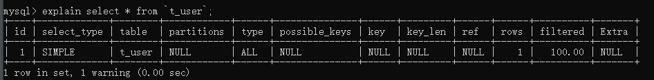

**primary**

​		一个需要union操作或者含有子查询的select，位于最外层的单位查询的select_ type即为primary，且只有一个。

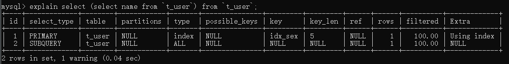

**union**

​		union连接的两个select查询，第一个查询是dervied派生表，除了第一个表外,第二个及以后的表都是union。

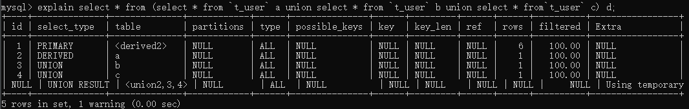

**dependent union**

​		与union一样，出现在union或union all语句中，但是这个查询要受到外部查询的影响。

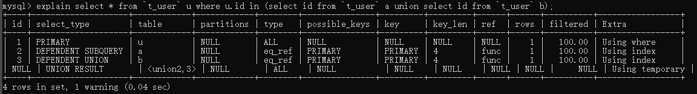

**union result**

​		包含union的结果集，在union和union all语句中，因为它不需要参与查询，所以id字段为null。

**subquery**

​		除了from字句中包含的子查询外，其他地方出现的子查询都可能是subquery。

**dependent subquery**

​		与dependent union类似，表示这个subquery的查询要受到外部表查询的影响。

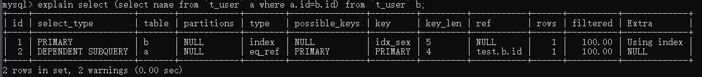

**derived**

​		from字句中出现的子查询，也叫做派生表，其他数据库中可能叫做内联视图或嵌套select。

#### 3. table

显示的单位查询的表名，有如下几种情况:
* 如果查询使用了别名，那么这里显示的是别名
* 如果不涉及对数据表的操作，那么这显示为null
* 如果显示为尖括号括起来的`<derived N>`就表示这个是临时表，N就是执行计划中的id，表示结果来自于这个查询产生。
* 如果是尖括号括起来的`<union M,N>`，其也是一个临时表，表示这个结果来自于union查询的id为M, N的结果集。
* `<subquery N>`，表示子查询结果被物化。

#### 4.type(重要)

显示的是单位查询的连接类型或者理解为访问类型,访问性能依次从好到差：

==system、const、eq_ref、ref、fulltext、ref_or_nu11、unique_、subquery、index_ subquery、range、index_merge、index、ALL==

> 注意：

* 除了all之外，其他的type都可以使用到索引
* 除了index_ merge之外，其他的type只可以用到一个索引
* 最差要使用到range级别

**system**

​		表中只有一行数据或者是空表。

**const (重要)**

​		使用唯一索引或者主键，返回记录定是1行记录的等值where条件时 ，通常type是const。其他数据库也叫做唯一。

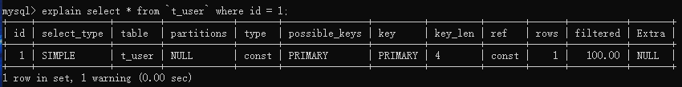

**eq_ref (重要)**

​		**针对唯一性索引**此类型通常出现在多表的join 查询，表示对于前表的每一个结果，都只能匹配到后表的一行结果，并且查询的比较操作通常是`=`，查询效率较高。

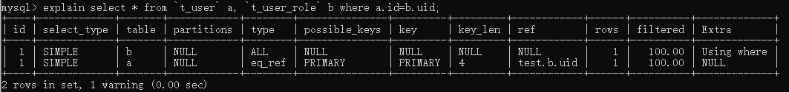

**ref (重要)**

​		**针对非唯一性索引**，使用等值( = )查询。或者是使用了最左前缀规则索引的查询。

* 组合索引

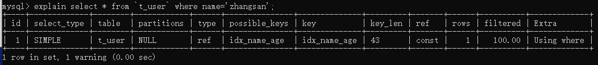

* 非唯一索引

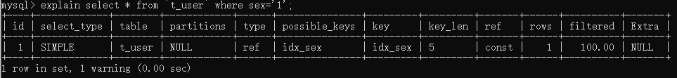

**fulltext**

​		全文索引检索，要注意，全文索引的优先级很高，若全文索引和普通索引同时存在时，mysql不管代价，优先选择使用全文索引。

**ref_or_null**

​		与ref方法类似，只是增加了null值的比较，实际用的不多。

**unique_ subquery**

​		用于where中的in形式子查询，子查询返回不重复值唯一值

**index_ subquery**

​		用于in形式子查询使用到了辅助索引或者in常数列表，子查询可能返回重复值，可以使用索引将子查询去重。

**range (重要)**

​		**索引范围扫描**，常见于使用>,<,is null, between ,in ,like等运算符的查询中。

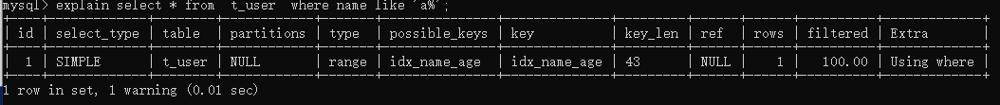

**index_ merge**

​		表示查询使用了两个以上的索引，最后取交集或者并集，常见and , or的条件使用了不同的索引，官方排序这个在ref_or_null之后,但是实际上由于要读取所个索引，性能可能大部分时间都不如range
**index (重要)**

​		select结果列中使用到了索引，type会显示为index。

​		**索引扫描**，把索引从头到尾扫一遍，常见于使用索引列就可以处理不需要读取数据文件的查询、可以使用索引排序或者分组的查询。==索引覆盖==

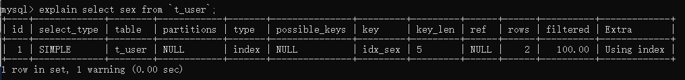

**all (重要)**

​		这个就是全表扫描数据文件，然后再在server层进行过滤返回符合要求的记录。

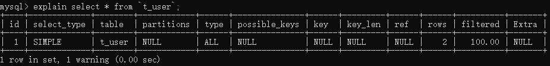

#### 5. possible_keys

此次查询可能选用的索引，一个或多个

#### 6. key

查询真正使用到的索引, select_type为index_merge时 ,这里可能出现两个以上的索引，其他的select_type这里只会出现一个。

#### 7. key_len

* 用于处理查询的索引长度，如果是单列索引,那就整个索引长度算进去，如果是多列索引，那么查询不一定都能使用到所有的列，具体使用到了多少个列的索引，这里就会计算进去，没有使用到的列，这里不会计算进去。
* 留意下这个列的值，算一下你的多列索引总长度就知道有没有使用到所有的列了。
* 另外, key_len只计算where条件用到的索引长度，而排序和分组就算用到了索引，也不会计算到key_len中。

#### 8. ref

* 如果是使用的常数等值查询,这里会显示const
* 如果是连接查询，被驱动表的执行计划这里会显示驱动表的关联字段
* 如果是条件使用了表达式或者函数,或者条件列发生了内部隐式转换，这里可能显示为func

#### 9. rows

这里是执行计划中估算的扫描行数,不是精确值（InnoDB不是精确的值，MyISAM是精确的值，主要原因是InnoDB里面使用了MVCC并发机制）。

#### 10. extra(重要)

这个列包含不适合在其他列中显示单十分重要的额外的信息，这个列可以显示的信息非常多, 有几十种。

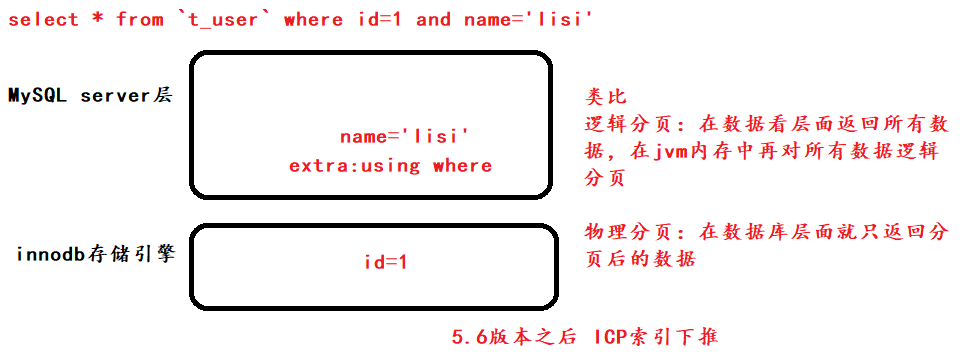

**using index (重要)**

​	查询时==不需要回表查询，直接通过索引就可以获取查询的结果数据==。

* 表示相应的SELECT查询中使用到了**覆盖索引( Covering Index )** ，避免访问表的数据行，效率不错!
* 如果同时出现Using Where， 说明索引被用来执行查找索引键值
* 如果没有同时出现Using Where表明索引用来读取数据而非执行查找动作。

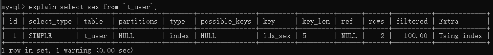

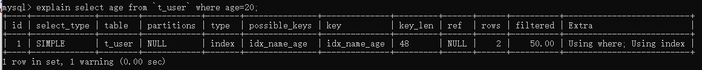

**using where (重要)**

​	表示MySQL将对storage engine提取的结果进行过滤，过滤条件字段无索引

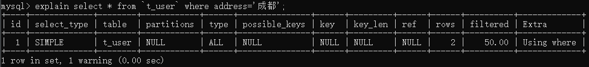

**using index condition(重要 )**

​	Using index condition 会先条件过滤索引,过滤完索弓后找到所有符合索引|条件的数据行,随后用WHERE子句中的其他条件去过滤这些数据行;
**using filesort (重要)**

* 排序时无法使用到索引时,就会出现这个。常见于order by和group by语句中.
* 说明MySQL会使用一 一个外部的索引排序,而不是按照索引顺序进行读取。
* MySQL 中无法利用索引|完成的排序操作称为"文件排序”

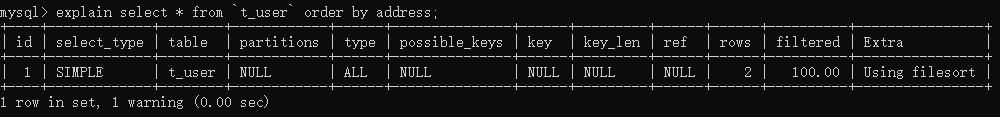

---

> [MySQL性能优化01：主题和目标](http://lampkins.gitee.io/2020/10/26/MySQL性能优化01/)
>
> [MySQL性能优化02：MySQL架构篇](http://lampkins.gitee.io/2020/10/26/MySQL性能优化02/)
>
> [MySQL性能优化03：MySQL性能分析篇](http://lampkins.gitee.io/2020/10/26/MySQL性能优化03/)
>
> [MySQL性能优化04：MySQL索引篇01索引讲解](http://lampkins.gitee.io/2020/10/26/MySQL性能优化04/)
>
> [MySQL性能优化05：MySQL索引篇02查看执行计划](http://lampkins.gitee.io/2020/10/26/MySQL性能优化05/)
>
> [MySQL性能优化06：MySQL索引篇03索引失效分析](http://lampkins.gitee.io/2020/10/26/MySQL性能优化06/)
>
> [MySQL性能优化07：性能优化篇](http://lampkins.gitee.io/2020/10/26/MySQL性能优化07/)

<script>
    let imgs = document.getElementsByTagName('img');
    for (let img of imgs) {
        img.setAttribute('class', 'fancybox');
    }
</script>