MySQL 索引失效分析

---

# MySQL索引篇

## 索引失效分析

### 案列环境

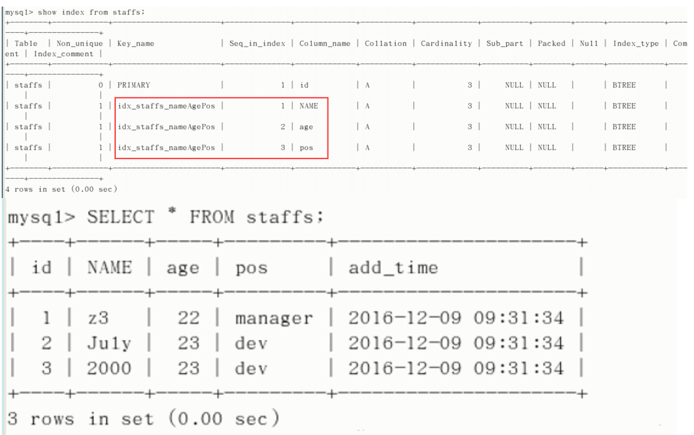

### 案列演示

#### 1. 全值匹配我最爱

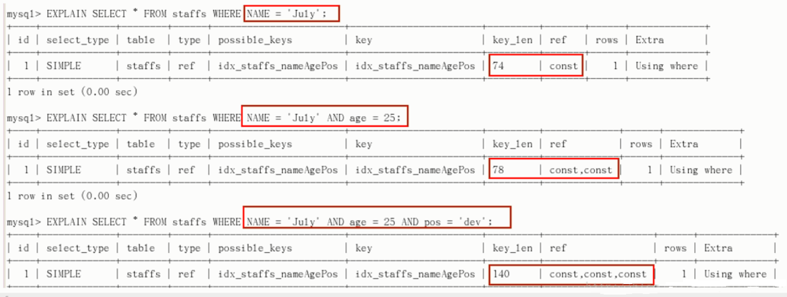

#### 2. 最佳左前缀法则

==带头索引不能死，中间索引不能断==

如果索引包含了多个列，要遵守最佳左前缀法则。指的是查询从索引的最左前列开始并且不跳过索引中的列。 正确的示例参考上图。

**错误的示例：**

带头索引死：

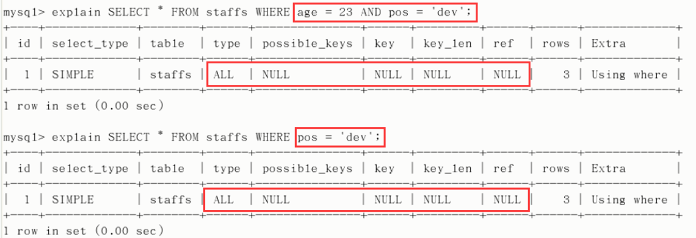

中间索引断（带头索引生效，其他索引失效）：

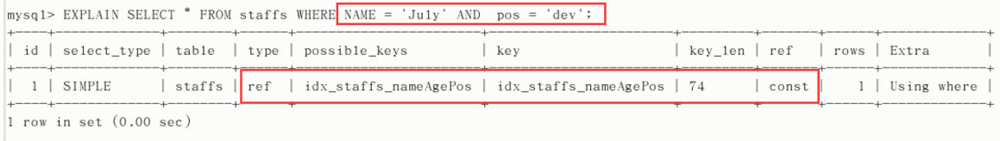

#### 3. 不要在索引上做计算

不要进行这些操作：计算、函数、自动/手动类型转换，不然会导致索引失效而转向全表扫描。

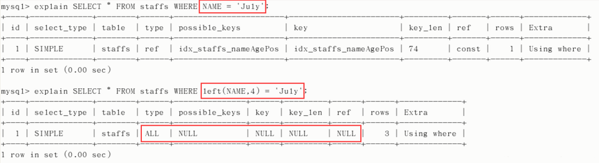

#### 4. 范围条件右边的列失效

不能继续使用索引中范围条件（bettween、<、>、in等）右边的列。

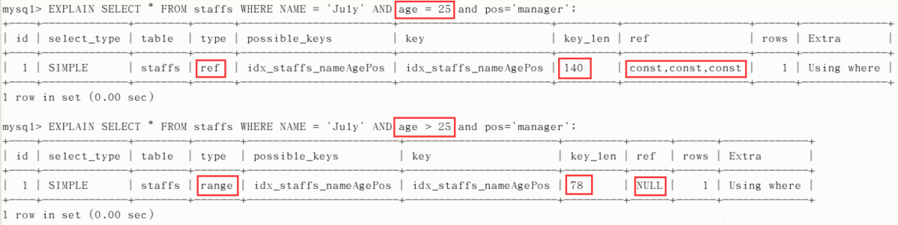

#### 5. 尽量使用覆盖索引

尽量使用覆盖索引，只访问索引的查询，也就是索引列和查询列一致，减少select *。

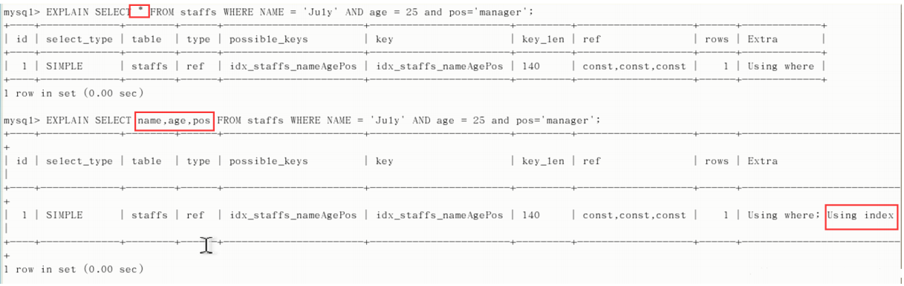

#### 6. 索引字段上不要使用不等

MySQL在索引字段上使用（！= 或者 < >）判断时，会导致索引失效而转向全表扫描。

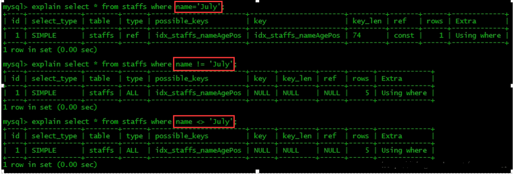

#### 7. 索引字段上不要判断null

索引字段上使用 is null / is not null 判断时，会导致索引失效而转向全表扫描。

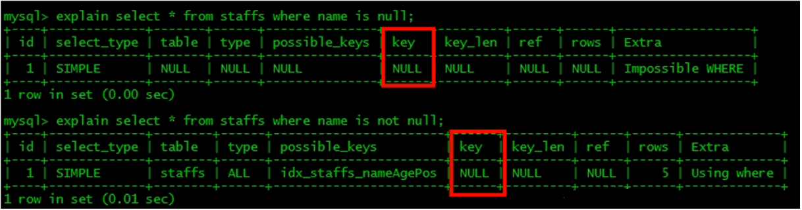

#### 8. 索引字段使用like不以通配符开头

索引字段使用like以通配符开头（‘%字符串’）时，会导致索引失效而转向全表扫描。

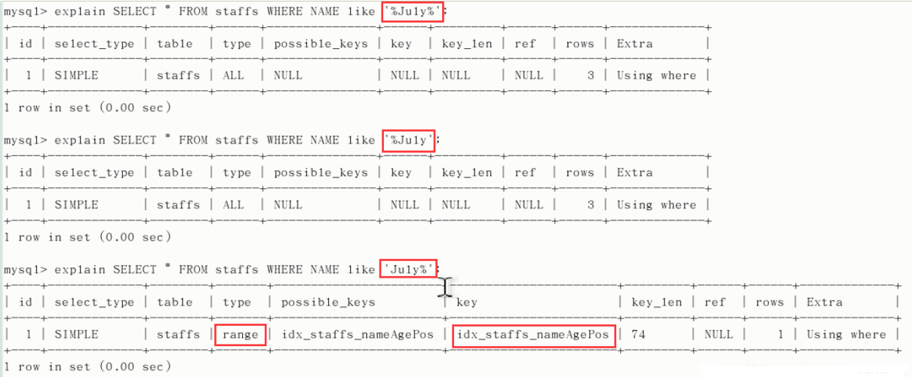

由结果可知，like以通配符结束相当于范围查找，索引不会失效。与范围条件（bettween、<、>、in等）不同的 是其不会导致右边的索引失效。

**问题：解决like ‘%字符串%’时，索引失效问题的方法？ **

使用覆盖索引可以解决。

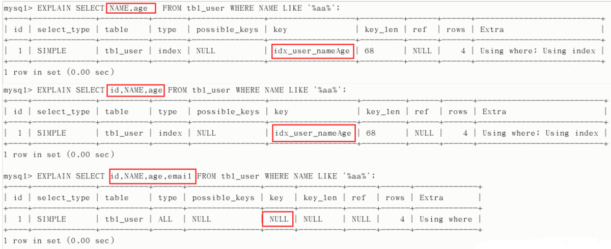

#### 9. 索引字段字符串要加单引号

索引字段是字符串，但查询时不加单引号，会导致索引失效而转向全表扫描。

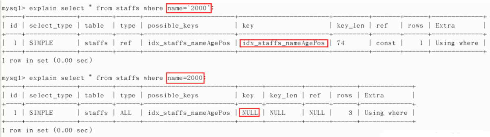

#### 10. 索引字段不要使用or

索引字段使用 or 时，会导致索引失效而转向全表扫描。

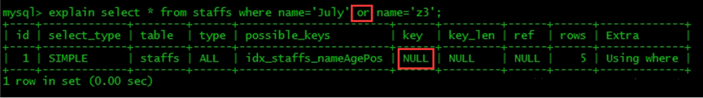

### 总结

> 假设index(a, b, c)

| Where语句                                                 | 索引是否被使用                       |
| :-------------------------------------------------------- | :----------------------------------- |
| where a=3                                                 | Y, 使用到a                           |
| where a=3 and b=5                                         | Y, 使用到a, b                        |
| where a=3 and b=5 and c=4                                 | Y, 使用到a, b, c                     |
| where b=3 或者 where b=3 and c=4 或者 where c=4 | N                                    |
| where a=3 and c=5                                         | 使用到a，但c不行，因为b中间断了      |
| where a=3 and b>4 and c=5                                 | 使用到a和b，c不能用在范围之后，b断了 |
| where a=3 and b like 'kk%' and c=4                        | Y, 使用到a, b, c                     |
| where a=3 and b like '%kk' and c=4                        | Y, 只用到a                           |
| where a=3 and b like '%kk%' and c=4                       | Y, 只用到a                           |
| where a=3 and b like 'k%kk%' and c=4                      | Y, 使用到a, b, c                     |

> **口诀**

**全值匹配我最爱，最左前缀要遵守；**
**带头大哥不能死，中间兄弟不能断；**
**索引列上少计算，范围之后全失效；**
**LIKE百分写最右，覆盖索引不写星；**
**不等空值还有or，索引失效要少用。**

---

> [MySQL性能优化01：主题和目标](http://lampkins.gitee.io/2020/10/26/MySQL性能优化01/)
>
> [MySQL性能优化02：MySQL架构篇](http://lampkins.gitee.io/2020/10/26/MySQL性能优化02/)
>
> [MySQL性能优化03：MySQL性能分析篇](http://lampkins.gitee.io/2020/10/26/MySQL性能优化03/)
>
> [MySQL性能优化04：MySQL索引篇01索引讲解](http://lampkins.gitee.io/2020/10/26/MySQL性能优化04/)
>
> [MySQL性能优化05：MySQL索引篇02查看执行计划](http://lampkins.gitee.io/2020/10/26/MySQL性能优化05/)
>
> [MySQL性能优化06：MySQL索引篇03索引失效分析](http://lampkins.gitee.io/2020/10/26/MySQL性能优化06/)
>
> [MySQL性能优化07：性能优化篇](http://lampkins.gitee.io/2020/10/26/MySQL性能优化07/)

