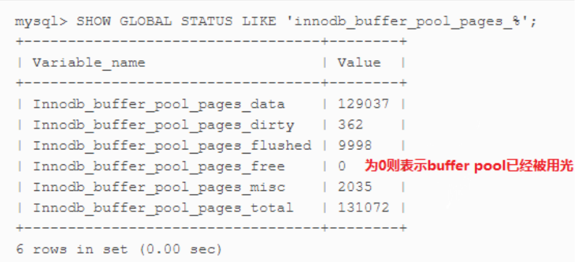

MySQL 性能优化手段

---

# MySQL性能优化篇

## 服务器层面优化

### 将数据保存在内存中，保证从内存读取数据

* 设置足够大的 `innodb_buffer_pool_size` ，将数据读取到内存中。

  ==建议`innodb_buffer_pool_size`设置为总内存大小的3/4或者4/5.==

* 怎样确定 `innodb_buffer_pool_size` 足够大。数据是从内存读取而不是硬盘？



### 内存预热

将磁盘数据在MySQL Server启动的时候就读取到内存中

### 降低磁盘写入次数

* 对于生产环境来说，很多日志是不需要开启的，比如：**通用查询日志、慢查询日志、错误日志**

* 使用足够大的写入缓存 **`innodb_log_file_size`**

  ==推荐 innodb_log_file_size 设置为 0.25 * innodb_buffer_pool_size==

* 设置合适的**`innodb_flush_log_at_trx_commit`**，和日志落盘有关系。

### 提高磁盘读写

* 可以考虑使用SSD硬盘，不过得考虑成本是否合适。

## SQL设计层面优化

**面对人群：** 懂技术并且了解需求的程序员。

**具体优化方案如下：** 

* **设计中间表**，一般针对于**统计分析**功能，或者实时性不高的需求（OLTP、OLAP）

* 为减少关联查询，创建合理的**冗余字段**（考虑数据库的三范式和查询性能的取舍，创建冗余字段还需要注意**数据一致性问题**）

* 对于字段太多的大表，考虑**垂直拆表**（比如一个表有100多个字段）

* 对于表中经常不被使用的字段或者存储数据比较多的字段，考虑拆表（比如商品表中会存储商品介绍，此时可 以将商品介绍字段单独拆解到另一个表中，使用商品ID关联）

* 每张表建议都要有一个主键（**主键索引**），而且主键类型最好是**int类型**，建议自增主键（**不考虑分布式系统 的情况下**）。

* **分库分表**

  数据库分表可以解决单表海量数据的查询性能问题，分库可以解决单台数据库的并发访问压力问题。

  一种常见的路由策略如下：

  ```
  中间变量　＝ user_id%（库数量*每个库的表数量）;
  库序号　＝　取整（中间变量／每个库的表数量）;
  表序号　＝　中间变量％每个库的表数量;
  ```

  例子：数据库有256 个，每一个库中有1024个数据表，用户的user_id＝262145，按照上述的路由策略，则：

  ```
  中间变量　＝ 262145%（256*1024）= 1;
  库序号　＝　取整（1／1024）= 0;
  表序号　＝　1％1024 = 1;
  ```

  对于user_id＝262145，其将被路由到第０个数据库的第１个表中。

## SQL语句优化（开发人员）

### 索引优化

* 为搜索字段（**where中的条件**）、排序字段、select查询列，创建合适的索引，不过要考虑数据的业务场景： 查询多还是增删多？

* 尽量建立**组合索引**并注意组合索引的创建顺序，按照顺序组织查询条件、尽量将筛选粒度大的查询条件放到最 左边。

* **尽量使用覆盖索引**，SELECT语句中尽量不要使用*。

* order by、group by语句要尽量使用到索引

### 其他优化

* 尽量不使用count(*)、尽量使用count（主键）

  * **COUNT(*) ：** 查询行数，是会遍历所有的行、所有的列。
  
  * **COUNT(列)：** 查询指定列不为null的行数（过滤null），如果列可以为空，则COUNT(\*)不等于 COUNT(列)，除非指定的列是非空的列才会让COUNT(*)等于COUNT(列)
  
  * **COUNT(伪列)：** 比如COUNT(1)

* JOIN两张表的关联字段最好都建立索引，而且最好字段类型是一样的。

  ```mysql
  SELECT * FROM orders o LEFT JOIN user u on o.user_id = u.id
  -- orders表中的user_id和user表中的id，类型要一致
  ```

* WHERE条件中尽量不要使用1=1、not in语句（建议使用not exists）

* 不用 MYSQL 内置的函数，因为内置函数不会建立查询缓存。

  ```mysql
  -- SQL查询语句和查询结果都会在第一次查询只会存储到MySQL的查询缓存中，如果需要获取到查询缓存中的查询结果，查询的SQL语句必须和第一次的查询SQL语句一致。
  SELECT * FROM user where birthday = now();
  ```

* 合理利用慢查询日志、explain执行计划查询、show profile查看SQL执行时的资源使用情况。

---

> [MySQL性能优化01：主题和目标](http://lampkins.gitee.io/2020/10/26/MySQL性能优化01/)
>
> [MySQL性能优化02：MySQL架构篇](http://lampkins.gitee.io/2020/10/26/MySQL性能优化02/)
>
> [MySQL性能优化03：MySQL性能分析篇](http://lampkins.gitee.io/2020/10/26/MySQL性能优化03/)
>
> [MySQL性能优化04：MySQL索引篇01索引讲解](http://lampkins.gitee.io/2020/10/26/MySQL性能优化04/)
>
> [MySQL性能优化05：MySQL索引篇02查看执行计划](http://lampkins.gitee.io/2020/10/26/MySQL性能优化05/)
>
> [MySQL性能优化06：MySQL索引篇03索引失效分析](http://lampkins.gitee.io/2020/10/26/MySQL性能优化06/)
>
> [MySQL性能优化07：性能优化篇](http://lampkins.gitee.io/2020/10/26/MySQL性能优化07/)

<script>
    let imgs = document.getElementsByTagName('img');
    for (let img of imgs) {
        img.setAttribute('class', 'fancybox');
    }
</script>