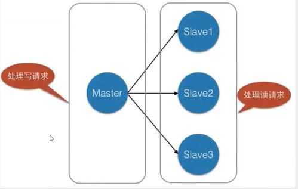

Redis 是一个内存中的数据结构存储系统，它可以用作数据库、缓存和消息中间件。

---

## NoSQL概述

NoSQL = Not Only SQL 不仅仅是SQL

关系型数据库：表格，行、列

很多的数据类型，如用户的个人信息、社交网络、地理位置。这些数据类型的存储不需要一个固定的格式， 不需要多余的操作就可以横向扩展。

#### 特点

1. 方便扩展(数据之间没有关系，很好扩展! )
2. 大数据量高性能( Redis一秒写8万次，读取11万，NoSQL的缓存记录级是一种细粒度的缓存，性能高!)
3. 数据类型是多样型的（不需要事先设计数据库，随取随用）
4. 传统RDBMS和NoSQL

```
传统的 RDBMS
- 结构化组织
- SQL
- 数据和关系都存在单独的表中
- 操作操作，数据定义语言
- 严格的一致性
- 基础的事务
- ...
```

```
Nosq1
- 不仅仅是数据
- 没有固定的查询语言
- 键值对存储，列存储，文档存储，图形数据库(社交关系)
- 最终一致性，
- CAP定理和BASE (异地多活)
- 高性能，高可用，高可扩
- ...
```

> 大数据的3V+3高
>
> 描述问题的：
>
> 1. 海量Volume
> 2. 多样Variety
> 3. 实时Velocity
>
> 对程序的要求：
>
> 1. 高并发
> 2. 高可拓
> 3. 高性能
>


## 五种基本数据类型

### Key（键）

```bash
redis-benchmark -h localhost -p 6379 -c 100 -n 100000
select x	#切换数据库
keys *	#查看数据库所有key
del key 	#删除key 
flushdb	#清空当前数据库
flushall	#清空全部数据库
exists key
type key
move key 2	#将kv移动到指定的库
expire key sec	#设置kv过期时间
ttl key	#查看剩余时间
```

###  String(字符串)

```bash
>strlen k1 #获取value的长度
>append k1 str #追加字符串，如果key不存在则相当于set key

>incr num #加一
(integer) 2
>get num
"2"
> decr num #减一
(integer) 1
> incrby num 5 #加一，步长为5
(integer) 6
> get k1
"strstr"
>getrange k1 1 2 #截取字符串[1, 2]
"tr"
> getrange k1 1 -1 #-1表示末尾
"trstr"
> setrange k1 2 x #替换指定位置的字符
(integer) 6
get k1
"stxstr"
# setex 设置含过期时间
# getnx key不存在才设置值（分布式锁中常用）

# mset	msetnx(当且仅当所有给定 key 都不存在才设值)
#mget
# HashTag即是用{}包裹key的一个子串，如{k}1，
#两个key拥有相同的HashTag:{k}, 它们会被分配到同一个slot，从而可使用MGET命令
> mset {k}1 v1 {k}2 v2 {k}3 v3
OK
mget {k}1 {k}2 {k}3
1) "v1"
2) "v2"
3) "v3"
> set user:1 {name:zs,age:21}
OK
> get user:1
"{name:zs,age:21}"

# getset
> get k1
"str"
> getset k1 str2 # 获取原来的值并设置新的值
"str"
> get k1
"str2"
```

String类型使用场景：

* 计数器
* 统计多单位的数量
* 抢购
  * 通过exists判断是否存在，如果不存在则先通过setnx初始化值，之后通过decrby判断商品数是否大于0，大于则抢购成功，否则失败

###  List（列表）

栈、队列、阻塞队列

```bash
> lpush l1 one #将一个或多个值插入到列表 key 的表头
(integer) 1
> lpush l1 two
(integer) 2
> lpush l1 three
(integer) 3
> lrange l1 0 -1
1) "three"
2) "two"
3) "one"
> rpush l1 rone #将一个或多个值插入到列表 key 的表尾
(integer) 4
> lrange l1 0 -1
1) "three"
2) "two"
3) "one"
4) "rone"

> lpop l1 #移除并返回列表 key 的头元素。
"three"
> rpop l1 #移除并返回列表 key 的尾元素。
"rone"
> lrange l1 0 -1
1) "two"
2) "one"

> lindex l1 0 #返回列表 key 中，下标为 index 的元素。
"two"
> lindex l1 -1
"one"

> llen l1 #返回列表的长度
(integer) 2

> lrange l1 0 -1
1) "three"
2) "two"
3) "one"
4) "three"
> lrem l1 2 three # 移除列表中|count|个value元素
(integer) 2
> lrange l1 0 -1
1) "two"
2) "one"

# count>0: 表头->表尾；<0: 表尾->表头；=0: 所有
> lrem l1 -1 three
(integer) 1
> lrange l1 0 -1
1) "three"
2) "two"
3) "one"
> lrem l1 1 three
(integer) 1
> lrange l1 0 -1
1) "two"
2) "one"
3) "three"
> lrem l1 0 three
(integer) 2
> lrange l1 0 -1
1) "two"
2) "one"

> lrange l1 0 -1
1) "hello"
2) "two"
3) "one"
4) "value"
> ltrim l1 2 3 #修剪list
OK
> lrange l1 0 -1
1) "one"
2) "value"

> lrange l1 0 -1
1) "one"
2) "two"
3) "three"
# 将l1的最后一个元素弹出，并返回给客户端。
# 并将弹出的元素作为l2的头元素 （）
> rpoplpush l1 l2 
"three"
> lrange l1 0 -1
1) "one"
2) "two"
> lrange l2 0 -1
1) "three"

> exists l1
(integer) 1
> lset l1 1 two2 #将列表下标为index的值设置为value
OK

# 将value插入到列表的值pivot的前面或后面
# linsert key before|after pivot value
> linsert l1 after two2 insert
(integer) 4
```

### Set（集合）

```bash
> sadd set1 hello
(integer) 1
> sadd set1 one
(integer) 1
> sadd set1 two
(integer) 1
> smembers set1 #查看set的所有成员
1) "two"
2) "one"
3) "hello"
> sismember set1 one #判断元素是否在集合中
(integer) 1
> scard set1 #获取集合中元素数量
(integer) 3
> srem set1 one #删除指定的元素
(integer) 1

> srandmember set1 
"hello"
> srandmember set1 2 #从集合中随机获取指定数量的元素
1) "memeber"
2) "hello"
> spop set1 [count] #随机移除一个元素并返回该元素
"memeber"
> smove set1 set2 two #将该元素从一个集合中移动到另一个集合中

# 集合论：差集、交集、并集
> sadd {set}1 one hello member
(integer) 3
> sadd {set}2 one two three
(integer) 3
> sdiff {set}1 {set}2 #差集 A-B
1) "member"
2) "hello"
> sinter {set}1 {set}2 #交集 A∩B
1) "one"
> sunion {set}1 {set}2 #并集 A∪B
1) "one"
2) "hello"
3) "member"
4) "three"
5) "two"
```

* 共同关注
* 推荐好友
* ···

### SortedSet（有序集合）

```bash
> zadd zset1 1 one
(integer) 1
> zadd zset1 2 two 3 three
(integer) 2
> zrange zset1 0 -1
1) "one"
2) "two"
3) "three"

> zadd score 75 zhangsan 87 lisi 60 wangwu
(integer) 3
> zrange score 1 2 #返回指定下标区间的成员，按score值递增排列
1) "zhangsan"
2) "lisi"
# 返回有序集中所有 score 值介于 min 和 max 之间(默认闭区间)的成员，并递增排列。
> zrangebyscore score -inf +inf #区间[-∞, +∞]
1) "wangwu"
2) zhangsan 
3) "lisi"
> zrangebyscore score 75 100 #区间[75, 100]
1) zhangsan 
2) "lisi"
> zrangebyscore score (75 +inf #区间(75, 100]
1) "lisi"
> zrangebyscore score (75 +inf withscores
1) "lisi"
2) "87"
> zrevrange score 1 2
# 返回有序集中所有 score 值介于 max 和 min 之间(默认闭区间)的成员，并递减排列。
> zrevrangebyscore score 100 75
1) "lisi"
2) "zhangsan"
> zcount score 75 80
(integer) 2
> zrem score lisi
(integer) 1
> zcard score
(integer) 2
```

* 1,普通消息 2, 重要消息   带权重存储

### Hash（哈希）

```bash
> hset h1 f1 v1 #将哈希表 key 中的域 field 的值设为 value 。
(integer) 1
> hget h1 f1
"v1"
> hmset h1 f1 v11 f2 hello f3 ye
OK
> hmget h1 f1 f2 
1) "v11"
2) "hello"
> hgetall h1 #获取全部的域和值
> hdel h1 f3 #删除指定的域
(integer) 1

> hlen h1
(integer) 2
> hkeys h1 #获取所有的域
1) "f1"
2) "f2"
> hvals h1 #获取所有域的值
1) "v11"
2) "hello"

> hset h1 f3 3
(integer) 1
> hincrby h1 f3 2 #加上一个值
(integer) 5
```

## 三种特殊数据类型

### Geospatial（地理位置）

存储到sorted set中

* 朋友定位
* 附近的人
* 打车距离
* ···

```bash
> geoadd china:city 104.065735 30.659462 ChengDu #添加位置的经纬度
(integer) 1
> geoadd china:city 116.405285 39.904989 BeiJing 121.472644 31.231706 ShangHai
(integer) 2

> geopos china:city ChengDu #获取指定成员的经纬度
1) 1) "104.06573742628097534"
   2) "30.65946118872339099"
> geopos china:city BeiJing ShangHai
1) 1) "116.40528291463851929"
   2) "39.9049884229125027"
2) 1) "121.47264629602432251"
   2) "31.23170490709807012"
```

**GEODIST key member1 member2 [unit]**
unit:

* m 表示单位为米。
* km 表示单位为千米。
* mi 表示单位为英里。
* ft 表示单位为英尺。

```bash
> geodist china:city ChengDu ShangHai #获取成都到上海的直线距离
"1660019.7699"
> geodist china:city ChengDu ShangHai km
"1660.0198"
```

**GEORADIUS key longitude latitude radius m|km|ft|mi [WITHCOORD(经纬度)] [WITHDIST(距离)] [WITHHASH] [COUNT count]**
以给定的经纬度为中心， 返回键包含的位置元素当中， 与中心的距离不超过给定最大距离的所有位置元素。
**GEORADIUSBYMEMBER key member radius m|km|ft|mi [WITHCOORD] [WITHDIST] [WITHHASH] [COUNT count]**
以给定成员为中心， 返回键包含的位置元素当中， 与中心的距离不超过给定最大距离的所有位置元素。

* 附近的人 （当前定位+半径）
* ···

```bash
> georadius china:city 104 30 100 km
1) "wuhou"
2) "jingjiang"
3) "ChengDu"
> georadius china:city 104 30 100 km withdist
1) 1) "wuhou"
   2) "71.5655"
2) 1) "jingjiang"
   2) "73.4188"
3) 1) "ChengDu"
   2) "73.6204"
> georadius china:city 104 30 100000 m withdist count 1
1) 1) "wuhou"
   2) "71565.4799"
> georadiusbymember china:city ChengDu 100 km
1) "jingjiang"
2) "ChengDu"
3) "wuhou"

# 该命令将返回11个字符的Geohash字符串
> geohash china:city jingjiang wuhou
1) "wm6n2kz2bw0"
2) "wm3yrd3bd70"
```

### HyperLogLogs

基数计算：统计一批数据中的不重复元素的个数
优点：占用固定的内存大小，最多2^64 12kb，大小和元素个数有关
缺点：有0.81%的标准误差，不能获取元素本身

* 记录一天会执行多少次各不相同的搜索查询		
* ···

```bash
> pfadd {pf}1 a b c d #将元素存入HyperLogLogs结构中
(integer) 1
> pfadd {pf}2 c d e f g
(integer) 1
> pfcount {pf}1 #返回其近似基数，
(integer) 4
> pfcount {pf}1 {pf}2
(integer) 7
> pfmerge {pf}3 {pf}1 {pf}2 #合并两组集合，并集
OK
> pfcount {pf}3
(integer) 7
```

### Bitmap

Blob类型，最大512MB

* 签到打卡 365 bit=45.625 byte
* 统计活跃用户（或运算）
* 用户是否在线
* ···

```bash
> setbit signin 0 1 #设置或者清空key的value(字符串)在offset处的bit值。
(integer) 0
> setbit signin 1 0
(integer) 0
> setbit signin 2 0
(integer) 0
> setbit signin 3 1
(integer) 0
> setbit signin 4 0
(integer) 0
> setbit signin 5 0
(integer) 0
> getbit signin 4 #返回offset处的bit值
(integer) 0
> bitcount signin
(integer) 2

> BITOP AND dest key1 key2
(integer) 6
```

## 事务

### Redis的事务

* 开启事务（multi）
* 命令入队（...）
* 执行事务（exec）
* 取消事务 （discard）
  编译时异常：如命令错误，事务中所有的命令都不会被执行
  运行时异常：事务队列中，错误的命令抛出运行时异常，但其他命令是可以正常执行的

```bash
> set str string
OK
> multi
OK
> get str #语法错误，事务不会被执行
QUEUED
> set str
(error) ERR wrong number of arguments for 'set' command
> exec
(error) EXECABORT Transaction discarded because of previous errors.

> multi
OK
> incr str #会产生运行时异常，事务中的该条命令不会被执行
QUEUED
> get str # 正常执行
QUEUED
> exec
1) (error) ERR value is not an integer or out of range
2) "string"
```

### 监控 Watch

监视一个(或多个) key ，如果在事务执行之前这个(或这些) key 被其他命令所改动，那么事务将被打断。
**悲观锁**

* 认为写操作多，遇到并发写的可能性高，以每次在读写数据的时候都会上锁
* java中的悲观锁就是Synchronized

**乐观锁**

* 认为读多写少，遇到并发写的可能性低
* 不会上锁，提交更新时会对数据冲突进行检测（比较版本号），失败则要重复读-比较-写的操作
* CAS、version控制

正常执行：

```bash
> set {a}money 100
OK
> set {a}out 0
OK
> watch money
OK
> multi
OK
> DECRBY money 20
QUEUED
> INCRBY out 20
QUEUED
> exec
1) (integer) 80
2) (integer) 20
```

测试多进程修改值。如果修改失败，获取最新的值就行

```bash
> watch money
OK
> multi
OK
> DECRBY money 10
QUEUED
> INCRBY out 10
QUEUED
> exec #执行之前，另一个线程修改了值，这时就会导致事务执行失败
(nil)

> unwatch # 如果发现事务执行失败，则先解锁再重新监视（select version）
OK
> watch money 
```

## SpringBoot整合

**jedis**：采用直连Redis Server，线程不安全，像BIO
**lettuce**：连接基于netty，连接实例可以再多个线程间共享，线程安全，像NIO

```java
    @Bean
    @ConditionalOnMissingBean(name = {"redisTemplate"})
    // 默认的RedisTemplate设置较少
    // 泛型都是Object，需要强转为<Sring, Object>
    public RedisTemplate<Object, Object> redisTemplate(RedisConnectionFactory redisConnectionFactory) throws UnknownHostException {
        RedisTemplate<Object, Object> template = new RedisTemplate();
        template.setConnectionFactory(redisConnectionFactory);
        return template;
    }

    @Bean
    @ConditionalOnMissingBean 
    //由于String比较常用，所以单独封装了一个
    public StringRedisTemplate stringRedisTemplate(RedisConnectionFactory redisConnectionFactory) throws UnknownHostException {
        StringRedisTemplate template = new StringRedisTemplate();
        template.setConnectionFactory(redisConnectionFactory);
        return template;
    }
```

自定义RedisTemplate

```java
@Configuration
public class RedisConfig {

    @Bean
    public RedisTemplate<String, Object> redisTemplate(LettuceConnectionFactory lettuceConnectionFactory) {
        RedisTemplate<String, Object> template = new RedisTemplate<>();
        template.setConnectionFactory(lettuceConnectionFactory);

        // Json序列化配置
        Jackson2JsonRedisSerializer<Object> jackson2JsonRedisSerializer = new Jackson2JsonRedisSerializer<>(Object.class);
        ObjectMapper om = new ObjectMapper();
        // 指定要序列化的域，field,get和set,以及修饰符范围，ANY是都有包括private和public
        om.setVisibility(PropertyAccessor.ALL, JsonAutoDetect.Visibility.ANY);
        // 指定序列化输入的类型，类必须是非final修饰的，final修饰的类，比如String,Integer等会抛出异常
        om.activateDefaultTyping(LaissezFaireSubTypeValidator.instance, ObjectMapper.DefaultTyping.NON_FINAL);
        jackson2JsonRedisSerializer.setObjectMapper(om);

        // key和hash的key 采用String的序列化方式
        template.setKeySerializer(new StringRedisSerializer());
        template.setHashKeySerializer(new StringRedisSerializer());
        // value和hash的value 采用Jackson的序列化方式
        template.setValueSerializer(jackson2JsonRedisSerializer);
        template.setHashValueSerializer(jackson2JsonRedisSerializer);
        template.afterPropertiesSet();

        return template;

    }
}
```

## Redis.conf

### 1. 包含 INCLUDES

{.fancybox}

###  2. 网络 NETWORK

```bash
bind 192.168.26.128 127.0.0.1 # 绑定的ip
protected-mode yes # 保护模式
port 6379 # 端口设置
```

### 3. 通用配置 GENERAL

```bash
daemonize yes # 以守护进程的方式运行，默认为no
supervised no # 可以通过upstart和systemd管理Redis守护进程, no/upstart/systemd/auto
pidfile /var/run/redis_6379.pid # 如果以后台的方式运行，需要指定一个pid文件

# 日志
# Specify the server verbosity level.
# This can be one of:
# debug (a lot of information, useful for development/testing)
# verbose (many rarely useful info, but not a mess like the debug level)
# notice (moderately verbose, what you want in production probably)
# warning (only very important / critical messages are logged)
loglevel notice
logfile "" # 日志文件路径
 
databases 16 # 默认16个数据库
always-show-logo yes # 显示Redis Logo
```

### 4. 快照 SNAPSHOTTING

持久化，在规定的时间内执行了多少次写操作，则会持久化到文件中，rdb、aof。

```bash
save 900 1 # 如果至少有1个key发生变化，900秒后则会进行持久化操作
save 300 10 # 如果至少有是10个key发生变化，300秒后则会进行持久化操作
save 60 10000 # 如果至少有是10000个key发生变化，60秒后则会进行持久化操作

stop-writes-on-bgsave-error no # 持久化出错后，是否需要继续工作
rdbcompression yes # 是否压缩rdb文件，需要消耗一CPU资源
rdbchecksum yes # 保存和加载rdb文件时是否进行错误的检查效验
dbfilename dump.rdb # rdb文件名
dir ./ # rdb文件保存路径

```

### 5. 复制 REPLICATION 

主从复制

### 6. 安全 SECURITY

```bash
requirepass foobared # 设置密码

# 通过命令更改密码
> config get requirepass
1) "requirepass"
2) ""
> config set requirepass "123456"
OK
> ping
(error) NOAUTH Authentication required.
> auth 123456
OK
> config get requirepass
1) "requirepass"
2) "123456"

```


### 7. 客户端 CLIENTS

```bash
maxclients 10000 # 设置同时连接的最大客户端数量
```

### 8. 内存管理 MEMORY MANAGEMENT

```bash
maxmemory <bytes> # 配置Redis最大内存限制

axmemory-policy noeviction #达到内存上限时Redis采用的清除策略
    1）volatile-lru	利用LRU算法移除有设置过期时间的key (LRU:最近使用 Least Recently Used ) 
    2）allkeys-lru	利用LRU算法移除任何key 
    3）volatile-random	移除有设置过期时间的随机key 
    4）allkeys-random	移除随机key
    5）volatile-ttl	移除即将过期的key(minor TTL) 
    6）noeviction  noeviction	不移除任何key，只是返回一个写错误 。默认选项
```

### 9. AOF配置 APPEND ONLY MODE

```bash
appendonly no # 默认不开启aof，在大部分情况下rdb已经够用了
appendfilename "appendonly.aof" # 持久化的文件名

# appendfsync always # 每次修改都会fsync()，安全但比较慢且耗性能
appendfsync everysec # 每秒执行一次fsync()，可能丢失1s的数据
# appendfsync no # 不执行fsync()，让操作系统自己同步数据，最快

# 重写规则
no-appendfsync-on-rewrite no
auto-aof-rewrite-percentage 100 #当aof日志大小增长率大于该值时，自动开启重写
auto-aof-rewrite-min-size 64mb #当aof日志大小增长到该值时，自动开启重写

```

## Redis持久化

Redis是内存数据库，如果没有持久化，那么断电后就会失去数据，所以Redis提供了持久化的功能。

### RDB（Redis Database）

在指定的时间间隔类将内存中的数据集进行快照存储，恢复的时候则将快照文件加载到内存中。

{.fancybox}

RDB在保存文件时父进程会单独创建（fork）一个子线程来进行持久化操作，先将数据写入一个临时文件中，写完成后，再用其替换掉上次已持久化的文件。整个过程主线程不进行IO操作，故而确保了极高的性能。如果需要进行大规模数据的恢复，且对于数据恢复的完整性不是非常敏感，那么RDB方式要比AOF方式更加的高效。

**触发机制**

1. save的规则满足的情况下，会自动触发RDB操作
2. 执行flushall命令
3. 退出Redis，也会产生RDB 文件

备份就自动生成了一个dump.rdb文件

**恢复rdb文件**

1. 只需要将rbd文件放在Redis配置目录，启动时会自动检查dump.rdb并从中恢复数据

2. 查看rdb文件保存路径

```bash
> config get dir 
1) "dir"
2) "/usr/local/redis/redis-cluster/7001"
```

**优点：**

* RDB是一个单一的紧凑的文件，方便传输
* 适用于数据集的备份，可以根据需求恢复到不同版本的数据集
* 适合大规模的数据恢复

**缺点:**

* 由于需要一定时间间隔进行操作，在Redis意外宕机时丢失的数据较多
* 当数据集比较大的时候，创建子进程的过程是非常耗时的，可能会导致Redis在一些毫秒级内不能响应客户端的请求。

### AOF（Append Only File）

以日志文本的形式记录Redis所处理的每一个写操作，恢复的时候把文件汇中的命令都执行一遍即可。

命令实时写入和重写(rewrite)，由于缓存的写操作是实时写入aof文件，当触发重写规则（如：aof文件过大）时，会重新生成恢复当前数据集所需的最小命令集合，即rewrite操作。


{.fancybox}

appendonly.aof

如果aof文件有问题，redis启动不了，可以通过`redis-check-aof --fix`工具修复aof文件。

**优点：**

* 每一次修改都同步，文件的完整性更好
* 每秒fsync时，可能会丢失一秒的数据，

**缺点:**

* 对于相同的数据集来说，aof文件体积远大于rdb，修复速度也比rdb慢
* 根据所使用的 fsync 策略，AOF 的速度可能会慢于 RDB。在处理巨大的写入载入时，RDB 可以提供更有保证的最大延迟时间（latency）

{.fancybox}

{.fancybox}

## Redis发布与订阅

Redis发布订阅(pub/sub)是一种==消息通信模式==：发送者(pub)发送消息，订阅者(sub)接收消息。传送消息的链路称为==信道==。

{.fancybox}

**命令**

| 序号 | 命令                                                         | 描述                               |
| ---- | ------------------------------------------------------------ | ---------------------------------- |
| 1    | [PSUBSCRIBE pattern [pattern ...]](https://www.runoob.com/redis/pub-sub-psubscribe.html) | 订阅一个或多个符合给定模式的频道。 |
| 2    | [PUBSUB subcommand [argument [argument ...\]]](https://www.runoob.com/redis/pub-sub-pubsub.html) | 查看订阅与发布系统状态。           |
| 3    | [PUBLISH channel message](https://www.runoob.com/redis/pub-sub-publish.html) | 将信息发送到指定的频道。           |
| 4    | [ PUNSUBSCRIBE [pattern [pattern ...\]]](https://www.runoob.com/redis/pub-sub-punsubscribe.html) | 退订所有给定模式的频道。           |
| 5    | [ SUBSCRIBE channel [channel ...]](https://www.runoob.com/redis/pub-sub-subscribe.html) | 订阅给定的一个或多个频道的信息。   |
| 6    | [ UNSUBSCRIBE [channel [channel ...\]]](https://www.runoob.com/redis/pub-sub-unsubscribe.html) | 只退订给定的频道。                 |

```bash
> SUBSCRIBE MyChannel # 订阅频道
Reading messages... (press Ctrl-C to quit)
1) "subscribe"
2) "MyChannel"
3) (integer) 1
# 等待读取推送的信息
1) "message" # 消息
2) "MyChannel" # 来自哪个频道的消息
3) "hello,test" # 消息的具体内容

> PUBLISH MyChannel "hello,test" # 将信息发送到指定的频道
(integer) 1
```

**使用场景**

* 用于构建即时通信应用，如：网络聊天室、实时广播、实时提醒等
* 订阅、关注系统

较复杂的场景会使用消息中间件 MQ

{.fancybox}

## Redis主从复制

#### 概念

主从复制,是指将一台Redis服务器的数据,复制到其他的Redis服务器。前者称为主节点(master/leader)，后者称为从节点(slave/follower) ；数据的复制是单向的，只能由主节点到从节点。Master以写为主，Slave 以读为主（读写分离）。

默认情况下，每台Redis服务器都是主节点；且一个主节点可以有多个从节点(或没有从节点) ，但一个从节点只能有一个主节点。

主从复制的作用主要包括：

1. **数据冗余：** 主从复制实现了数据的热备份，是持久化之外的一种数据冗余方式。
2. **故障恢复：** 当主节点出现问题时，可以由从节点提供服务,实现快速的故障恢复；实际上是-一种服务的冗余。
3. **负载均衡：** 在主从复制的基础上，配合读写分离，可以由主节点提供写服务，由从节点提供读服务(即写Redis数据时应用连接主节点,读Redis数据时应用连接从节点)，分担服务器负载；尤其是在写少读多的场景下，通过多个从节点分担读负载，可以大大提高Redis服务器的并发量。
4. **高可用基石：** 除了上述作用以外，主从复制还是哨兵和集群能够实施的基础，因此说主从复制是Redis高可用的基础。

{.fancybox}

```bash
> info replication # 查看当前redis节点信息
# Replication
role:master
connected_slaves:1
slave0:ip=192.168.26.128,port=7006,state=online,offset=280,lag=1
master_replid:8a90b2da230485bb190eb2e443bb324cbb8d7371
master_replid2:0000000000000000000000000000000000000000
master_repl_offset:280
second_repl_offset:-1
repl_backlog_active:1
repl_backlog_size:1048576
repl_backlog_first_byte_offset:1
repl_backlog_histlen:280

```

#### **搭建**

##### 1. 修改配置文件

```bash
bind 
port 7001
daemonize yes
pidfile /var/run/redis_7001.pid
logfile "redis_7001.log"
dbfilename dump_7006.rdb
cluster-enabled yes # 开启集群  
cluster-config-file nodes_7001.conf   # 集群的配置 配置文件
cluster-node-timeout  15000      

```

##### 2. 脚本启动文件`start.sh`

```bash
#!/bin/bash
cd 7001 && ../../bin/redis-server redis.conf
cd ../7002 && ../../bin/redis-server redis.conf
cd ../7003 && ../../bin/redis-server redis.conf
cd ..
```

##### 3. 主从复制模式配置（master-slave replication）（还有多级复制）

* 一主二从，命令中配置，本次运行有效

  主机可以设置值，从机只能读；

  主机宕机后，从机依旧连接到主机，主机重启后从机会自动连接上；

  从机重启后，则会变为主机，只要又设置为从机，则会立即从主机复制数据；

  如果主机断开了连接，可以使用`SLAVEOF no one`让自己变成主机，其他的节点就可以手动连接到最新的这个主节点( 手动选举)。

> 复制原理
>
> Slave启动成功连接到master后会发送一个sync同步命令
> Master接到命令，启动后台的存盘进程，同时收集所有接收到的用于修改数据集命令，在后台进程执行完毕之后， ==master将传送整个数据文件到slave，并完成一-次完全同步。==
> **全量复制：** 而slave服务在接收到数据库文件数据后,将其存盘并加载到内存中。
> **增量复制：** Master继续将新的所有收集到的修改命令依次传给slave，完成同步
> 但是只要是重新连接master , 一次完全同步(全量复制)将被自动执行

```bash
>SLAVEOF 127.0.0.1 7001
OK

> info replication
# Replication
role:slave # 从节点
master_host:192.168.26.128
master_port:7001 # 它的主节点
master_link_status:up
master_last_io_seconds_ago:1
master_sync_in_progress:0
slave_repl_offset:2128
slave_priority:100
slave_read_only:1
connected_slaves:0
master_replid:c4b29fdc590e84132d6055078fa03306a6ed1cbf
master_replid2:0000000000000000000000000000000000000000
master_repl_offset:2128
second_repl_offset:-1
repl_backlog_active:1
repl_backlog_size:1048576
repl_backlog_first_byte_offset:1
repl_backlog_histlen:2128

```

##### 4. 哨兵模式（ Sentinel）

哨兵模式是一种特殊的模式，首先Redis提供了哨兵的命令，哨兵是一个独立的进程,作为进程,它会独立运行。

三个任务：

* **监控（Monitoring）**： Sentinel 会不断地检查主服务器和从服务器是否运作正常。

- **提醒（Notification）**： 当被监控的某个 Redis 服务器出现问题时， Sentinel 可以通过 API 向管理员或者其他应用程序发送通知。
- **自动故障迁移（Automatic failover）**：当一个主服务器不能正常工作时， Sentinel 会使用投票协议（agreement protocols）来决定是否执行自动故障迁移， 以及选择哪个从服务器作为新的主服务器。

{.fancybox}

这里的哨兵有两个作用

* 通过发送命令，让Redis服务器返回监控其运行状态，包括主服务器和从服务器。
* 当哨兵监测到master宕机，会自动将slave切换成master，然后通过==发布订阅==模式通知其他的从服务器,修改配置文件，让它们切换主机。

然而一个哨兵进程对Redis服务器进行监控,可能会出现问题，为此，我们可以使用多个哨兵进行监控。各个哨兵之间还会进行监控,这样就形成了多哨兵模式。

{.fancybox}

假设主服务器宕机，哨兵1先检测到这个结果，系统并不会马上进行failover过程，仅仅是哨兵1主观的认为主服务器不可用，这个现象成为**主观下线**。当后面的哨兵也检测到主服务器不可用,并且数量达到一定值时，那么哨兵之间就会进行一次投票，投票的结果由一个哨兵发起，进行failover[故障转移]操作。切换成功后，就会通过发布订阅模式,让各个哨兵把自己监控的从服务器实现切换主机，这个过程称为**客观下线**。

**配置**

```bash
# 监视一个名为mymaster的主服务器，其IP为127.0.0.1和port为7001，
# 2代表至少需要2个Sentinel同意（大多数Sentinel正常），该服务器才被判断为已失效宕机 
sentinel monitor mymaster 127.0.0.1 7001 2
```


```bash
# 查看节点信息
./redis-cli -h 192.168.26.128 -c -p 7001 cluster nodes
```

## Redis缓存穿透和雪崩

Redis缓存的使用，极大的提升了应用程序的性能和效率，特别是数据查询方面。但同时，它也带来了一些问题。其中，最要害的问题，就是数据的一致性问题，从严格意义上讲，这个问题无解。如果对数据的一致性要求很高，那么就不能使用缓存。

另外的一些典型问题就是，缓存穿透、缓存雪崩和缓存击穿。目前，业界也都有比较流行的解决方案。

{.fancybox}

#### 缓存穿透

> **概念：**

​		缓存穿透的概念很简单，用户想要查询一个数据，发现redis数据库没有，即缓存未命中，于是从持久层数据库查询。发现也没有，则本次查询失败。当用户很多的时候，缓存都没有命中(秒杀! )，于是都去请求持久层数据库。这就给持久层数据库带来很大的压力，这时候就相当于出现了缓存穿透。

> **解决方案：**

**布隆过滤器**

布隆过滤器是一种数据结构，对所有可能查询的参数以hash形式存储，在控制层先进行校验，不符合则丢弃，从而避免了对底层存储系统的查询压力;

{.fancybox}

**缓存空对象**

当存储层未命中后，即使返回的是空对象也将其缓存起来，同时设置一个过期时间，之后再访问该数据将会从缓存中获取，避免了给后端数据库带来压力。

{.fancybox}

但是这种方法会存在两个问题：

1. 如果空值能够被缓存起来，这就意味着缓存需要更多的空间存储更多的键；
2. 即使对空值设置了过期时间，还是会存在缓存层和存储层的数据会有一段时间窗口的不一致，这对于需要保持一致性的业务会有影响。

#### 缓存击穿

> **概述**

​		这里需要注意和缓存击穿的区别缓存击穿，是指一个key非常热点，在不停的扛着大并发，大并发集中对这一个点进行访问，当这个key在失效的瞬间，持续的大并发就穿破缓存，直接请求数据库，就像在一个屏障上凿开了一个洞。

​		当某个key在过期的瞬间，有大量的请求并发访问，这类数据一般是热点数据，由于缓存过期，会同时访问数据库来查询最新数据，并且回写缓存，会导使数据库瞬间压力过大。

> **解决方案**

**设置热点数据永不过期**

从缓存层面来看，没有设置过期时间，所以不会出现热点key过期后产生的问题。

**加互斥锁**

分布式锁：使用分布式锁，保证对于每个key同时只有一个线程去查询后端服务，其他线程没有获得分布式锁的权限，因此只需要等待即可。这种方式将高井发的压力转移到了分布式锁，因此对分布式锁的考验很大。

{.fancybox}

#### 缓存雪崩

缓存雪崩，是指在某一个时间段，缓存集中过期失效，Redis 宕机。

比如在写本文的时候,马上就要到双11零点，很快就会迎来一波抢购，这波商品时间比较集中的放入了缓存，假设缓存一个小时。那么到了凌晨一点钟的时候，这批商品的缓存就都过期了。而对这批商品的访问查询，都落到了数据库上，对于数据库而言,就会产生周期性的压力波峰。于是所有的请求都会达到存储层，存储层的调用量会暴增，造成存储层也会挂掉的情况。

{.fancybox}

其实集中过期，倒不是非常致命，比较致命的缓存雪崩，是缓存服务器某个节点宕机或断网。因为自然形成的缓存雪崩，一定是在某个时间段集中创建缓存，这个时候，数据库也是可以顶住压力的。无非就是对数据库产生周期性的压力而已。而缓存服务节点的宕机，对数据库服务器造成的压力是不可预知的，很有可能瞬间就把数据库压垮。

双11：停掉一些服务，( 保证主要的服务可用 )

> **解决方案**

**redis高可用**

这个思想的含义是，既然redis有可能挂掉，那我多增设几台redis，这样一台挂掉之后其他的还可以继续工作，其实就是搭建的集群。（异地多活）

**限流降级**

这个解决方案的思想是，在缓存失效后，通过加锁或者队列来控制读数据库写缓存的线程数量。比如对某个key只允许一个线程查询数据和写缓存，其他线程等待。

**数据预热**

数据加热的含义就是在正式部署之前，先把可能的数据先预先访问一遍，这样部分可能大量访问的数据就会加载到缓存中。在即将发生大并发访问前手动触发加载缓存不同的key，设置不同的过期时间，让缓存失效的时间点尽量均匀。