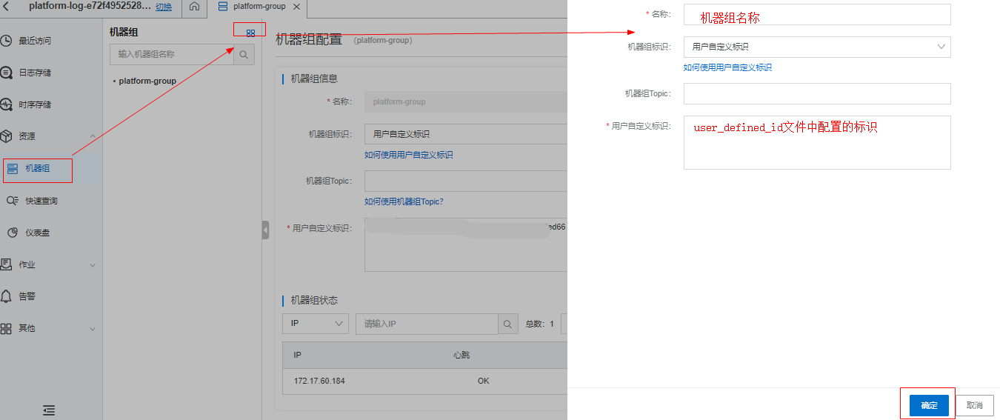
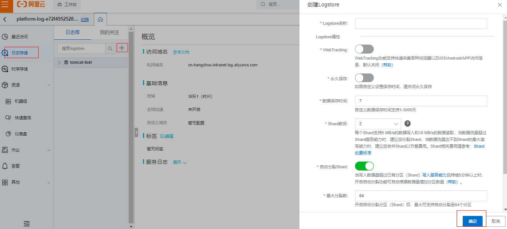
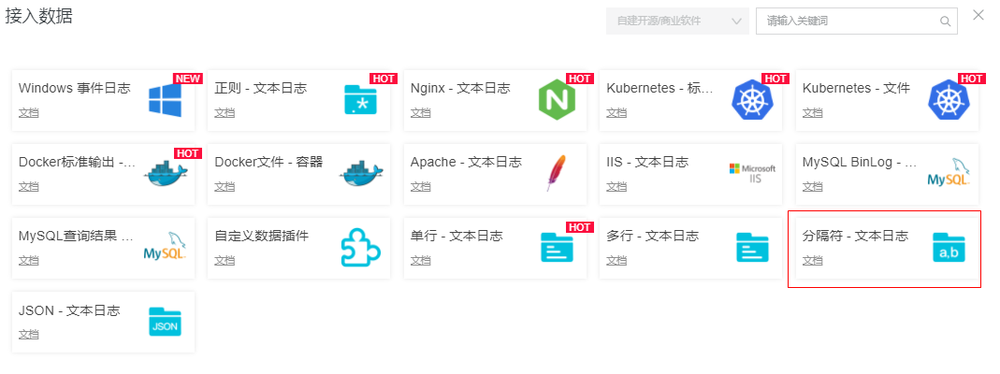
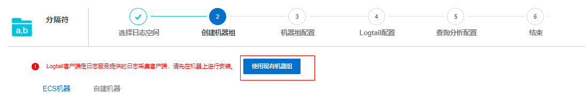
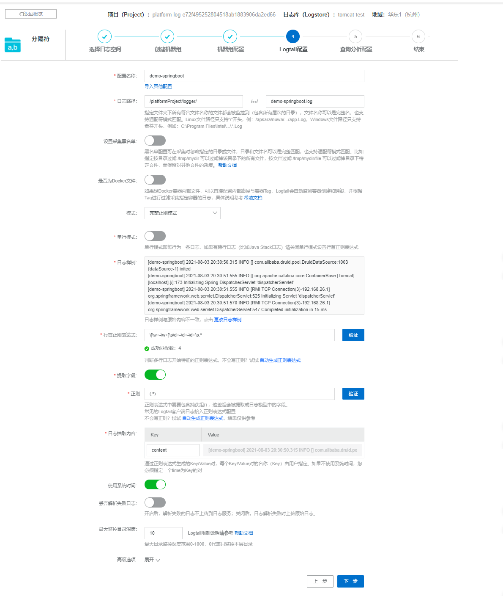
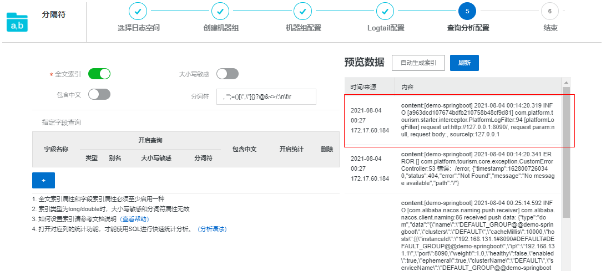

阿里云配置日志采集服务

---

## 一. 安装Logtail

1. 下载Logtail安装脚本

```bash
wget http://logtail-release-cn-hangzhou.oss-cn-hangzhou.aliyuncs.com/linux64/logtail.sh -O logtail.sh;chmod 755 logtail.sh
```

2. 使用auto参数安装logtail

```bash
./logtail.sh install auto
```

3. logtail常用命令

```bash
# 启动logtail
/etc/init.d/ilogtaild start
# 停止logtail
/etc/init.d/ilogtaild stop
# 查看logtail状态
/etc/init.d/ilogtaild status

```

## 二. 配置用户标识

打开[云命令行](https://shell.aliyun.com/?spm=a2c4g.11186623.2.10.56471727wJd6GR)，执行命令`echo $ALIBABA_CLOUD_ACCOUNT_ID`，复制用户标识，在 /etc/ilogtail/users目录下，创建账号ID同名文件：`touch /etc/ilogtail/users/1*************`

## 三. 配置用户自定义标识机器组

1. 在`/etc/ilogtail/`目录下创建`user_defined_id`文件，编辑该文件，配置自定义的标识
2. 创建机器组，状态中心跳为OK即为配置成功




## 四. 配置日志存储Logstore

1. 按官方说明创建即可



2. logtail配置，接入数据

   按需求选择数据类型，我这里接入的分隔符-文本日志；



​	创建机器组直接使用前面配置的机器组



​	Logtail配置：日志样例，可复制实际项目的日志记录，再编写正则验证是否成功匹配

```
行首正则表达：\[\w+-\w+]\s\d+-\d+-\d+\s.*
```



可以看到已经接入了日志数据



-----------------------------------------------------

```bash
# 关闭应用的脚本
#!/bin/bash
PID=$(ps -ef |grep app.jar |grep -v grep |awk '{ print $2 }')
if [ -z"$PID" ]
then
    echo Application is already stopped
else
    echo kill $PID
    kill $PID
fi

# 启动应用的脚本
#!/bin/bash
nohup java -jar app.jar >tmp.log &
```

<script>
    let imgs = document.getElementsByTagName('img');
    for (let img of imgs) {
        img.setAttribute('class', 'fancybox');
    }
</script>